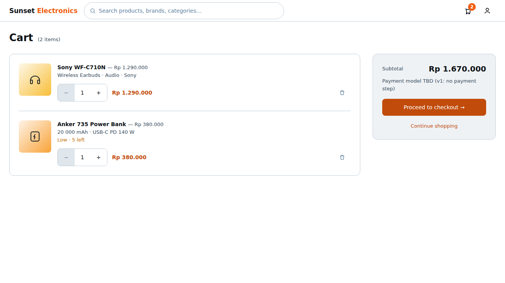

# Page: Cart — Design Spec (Sunset Glow)

Palette: `docs/color-tokens.md`. Roles: `Sheets-report.md`.
Order flow: **Cart → Checkout → Orders Placed** (locked by the sheet's checkout use case).
Typography & spacing per `docs/design-tokens-round3.md` (Inter 400/500/600, 8pt grid,
unified pill badges, filled CTA stack).

## FEATURES

- Buyer-only cart (matrix: "add product to cart" buyer T, all others F).
- Cart contents: image, name (+ model / category + brand subline, e.g. "Sony
  WF-C710N" / "Wireless Earbuds · Audio · Sony"), unit price, quantity stepper,
  line total; order subtotal + "Proceed to checkout" (the sheet's "Buy/Checkout" CTA).
- **Cart persistence (open decision #3): TBD.** Most likely interpretation:
  **session-based** (survives navigation/refresh, cleared or kept on logout
  undecided; not synced across devices). The UI is persistence-agnostic — item
  counts come from the client state layer (`CartStore`), which the team will
  back with either session storage or `POST /cart` (high-level API assumption,
  undecided). If it later becomes user-persisted, nothing on this page changes
  except the store implementation.
- Quantity change re-validates stock (stock may have dropped since add):
  line clamps to available stock with a `strawberryRed` note "Only N available —
  quantity reduced".
- Remove item: trash icon per line; no undo in v1 (flagged assumption).
- Preconditions for checkout (from Sheet2): logged in (route guard) and
  **≥1 item** (route guard / CTA enable logic).

## LINKS / NAVIGATION

- Arrivals: Add-to-Cart toast "View cart", header cart badge.
- "Proceed to checkout" → Checkout (order-flow step 2).
- "Continue shopping" / card links → Product Details / Main Store.
- Empty cart: primary CTA → Main Store.

## VISUALIZATION




ASCII wireframe (desktop):

```
+------------------------------------------------------------------+
| Sunset Electronics [ search........ ]  (cart:2)  (account)       |
+------------------------------------------------------------------+
| Cart (2 items)                                                  |
| +--------------------------------------------+ +--------------+ |
| | [84×84 tile] Sony WF-C710N — Rp 1.290.000  | | Subtotal      | |
| |            Wireless Earbuds · Audio · Sony | | Rp 1.670.000 | |
| |            [ − 1 + ]  Rp 1.290.000   [trash]| | (20/28 w600) | |
| | -------------------------------------------| | Payment TBD  | |
| | [84×84 tile] Anker 735 Power Bank — Rp380k | | [ Proceed to | |
| |            20 000 mAh · USB-C PD 140 W     | |  checkout → ] | |
| |            Low · 5 left  [ − 1 + ] Rp380k   | | Continue     | |
| +--------------------------------------------+ + shopping     | |
|  lines in one bordered card, 24px pad, 24px between lines;    | |
|  summary panel 320px, blueSlate-50 bg, 32px gutter            | |
+------------------------------------------------------------------+
```

Mobile (<768px): summary collapses to a sticky bottom bar: "Subtotal · [Checkout]" —
the primary CTA must be reachable without scrolling on 390px.

## COLOR USAGE

| Element | Token |
|---|---|
| Canvas / line border | `#FFFFFF` / `blueSlate-200` |
| Product name | `blueSlate-950` 15/24 w600; unit price in name line muted `blueSlate-700` 13/400 |
| Line total / unit price value | `atomicTangerine-600` 14/20 w600 |
| Low-stock line hint ("Low · 5 left") | `carrotOrange-600` 13/400 |
| Quantity stepper | `blueSlate-200` border, radius 8px, 44px cells; value `blueSlate-950`; disabled side `blueSlate-100`/`blueSlate-500` |
| Remove (trash) icon button | 44×44, `blueSlate-500` glyph → hover `strawberryRed-600` |
| Stock-clamp note | `strawberryRed-600` |
| Summary panel bg / border | `blueSlate-50` / `blueSlate-200`, radius 12px |
| Subtotal label / value | `blueSlate-700` 13/400 / `blueSlate-950` 20/28 w600 |
| "Proceed to checkout" | filled 44px primary: `atomicTangerine-600` idle → `-700` hover → `-800` active, white 14/500 label; disabled = `blueSlate-100` bg + `blueSlate-400` text |
| "Continue shopping" link | `atomicTangerine-600` 13px, underline on hover |
| Empty-cart icon + heading | `blueSlate-300` icon, `blueSlate-950` heading, helper `blueSlate-700` |

## INTERACTIONS

(React: `CartPage`, `CartLine`, `QuantityStepper` (shared with Product Details),
`CartSummary`.)

- **Idle:** lines render in insertion order (assumption — most natural); each line is
  44px-min touch height, row rhythm inside the lines card is 24px.
- **Quantity:** `POST /cart/items/:id/qty` (assumption); stepper max = current stock
  (fetched per line); at 1 the "−" disables (`blueSlate-100`/`blueSlate-500`).
- **Remove:** line animates out (color-only when `prefers-reduced-motion`); subtotal
  updates; header badge updates.
- **Stock clamp:** if server returns reduced qty → line shows `strawberryRed` note;
  stepper max lowered.
- **Empty state:** "Your cart is empty" + `blueSlate-300` outline cart icon +
  "Start shopping" filled primary button (`atomicTangerine-600` → `-700` → `-800`
  stack, white label).
- **Checkout CTA enabling:** enabled only when ≥1 line AND no unresolved stock
  conflict; disabled state = `blueSlate-100` bg + `blueSlate-400` label; empty → CTA
  removed (see empty state).
- **Loading:** static line skeletons (`blueSlate-100` blocks — no shimmer); summary
  values show "…" placeholders.
- **Error:** per-line retry link (`strawberryRed-600`) on quantity/remove failure;
  page-level `strawberryRed-100` bg / `strawberryRed-700` text panel on cart load 5xx.
- **Role-based visibility:** staff/manager/admin have no route to this page
  (matrix F). If mis-routed → redirect to their dashboard.
- **a11y:** each line a list item with name + total exposed; stepper buttons
  labeled "Decrease/increase quantity for X"; badge count via `aria-label`;
  focus ring 2px `atomicTangerine-500` offset 2.
