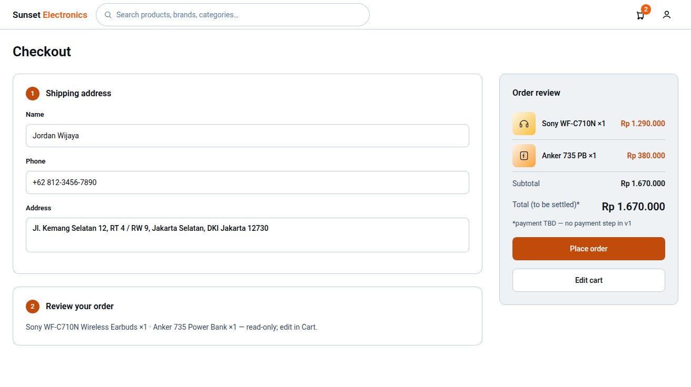

# Page: Checkout — Design Spec (Sunset Glow)

Palette: `docs/color-tokens.md`. Roles: `Sheets-report.md`.
Order flow: **Cart → Checkout → Orders Placed**. This page implements the sheet's
checkout use case (Sheet2) in full.
Typography & spacing per `docs/design-tokens-round3.md` (Roboto 400/500/600, 8pt grid,
unified pill badges, filled CTA stack).

## FEATURES

- Buyer-only (matrix: purchase/add-to-cart F for staff+). Preconditions: logged in
  + cart ≥1 item (route guard; otherwise redirect to Cart / Main Store).
- Step layout (single-page two-panel layout, no multi-page wizard — most likely v1):
  1. **Shipping address** (name, phone, address — assumed minimum set; flagged).
  2. **Order review** (line list, read-only, from cart).
  3. **Place order** (primary CTA in the summary panel).
- **Domain examples (electronics):** order lines show model + category context,
  e.g. "Sony WF-C710N Wireless Earbuds ×1" / "Anker 735 Power Bank ×1"; shipping
  form copy can mention electronics (fragile-item / packaging note optional —
  assumption, not required by the sheet).
- **Payment model (open decision #4): TBD.** The sheet defines **no payment at all** —
  no gateway, no currency even; orders just sit "pending". Most likely interpretation
  for v1 UI: **no payment step**; CTA label is "Place order" not "Pay now", and the
  summary shows "Total (to be settled)" — i.e. payment-agnostic. Design keeps a
  clearly marked `PaymentSlot` placeholder component so a gateway can slot in
  later without re-laying the page. **Do not add payment UI in v1.**
- **Stock check + decrement (locked + open decision #5):** on submit the system
  checks availability & stock first (Sheet2 basic flow). Decrement semantics
  (automatic vs manager-manual) are **TBD** — the UI shows only the consequences:
  success = order created `pending`; stock-out = alt-flow 3a (below).
- **Order created with status `pending`** (locked), stock validated; on success
  stock decremented (sheet postcondition). Buyer is read-only afterwards
  (PATCH is staff+ only).
- Alt flow 3a — out of stock on submit: error message, checkout cancelled,
  **no state change**; the conflicting line is highlighted, quantity clamped,
  user can edit (go back to Cart) or retry.
- Alt flow 5a — connection failure: failure notification, **retry** affordance;
  idempotency concern flagged (do not create a duplicate order on retry —
  high-level API assumption: client-generated order id).

## LINKS / NAVIGATION

- Arrival: Cart "Proceed to checkout". No other entry (deep-linking not allowed —
  guarded route; state comes from Cart).
- "Edit cart" → Cart (preserves state).
- Success → **Orders Placed** (confirmation; the sheet's redirect target).
- Failure states stay on Checkout (no navigation).

## VISUALIZATION



> mockup.png rendered from _mockup-build/out/checkout.html via headless Chromium @ 2026-09-22


ASCII wireframe (desktop):

```
+------------------------------------------------------------------+
| Sunset Electronics [ search........ ]  (cart:2)  (account)       |
+------------------------------------------------------------------+
| Checkout                                                        |
| +----------------------------------------+ +------------------+ |
| | [1] Shipping address                   | | Order review     | |
| | Name   [____________________________]   | | [44px] Sony C710N| |
| | Phone  [____________________________]   | |         ×1 Rp1.29jt| |
| | Address[____________________________]   | | [44px] Anker PB  | |
| |        (66px min)                       | |          ×1 Rp380k| |
| |                                          | | Subtotal    Rp1.67jt| |
| +----------------------------------------+ | Total*      Rp1.67jt| |
| | [2] Review your order                    | | *payment TBD     | |
| | Sony WF-C710N ×1 · Anker 735 PB ×1 —    | | [ Place order ] | |
| | read-only; edit in Cart.                 | | [ Edit cart ]    | |
| +----------------------------------------+ +------------------+ |
| step numbers: 26px circular badges, atomicTangerine-600 fill,  | |
| white 13/600 digit; section titles 16/24 w600                 | |
+------------------------------------------------------------------+
```

Mobile: single column, order summary first (collapsible, default open on first
load), sticky bottom bar with "Place order" + total on 390px.

## COLOR USAGE

| Element | Token |
|---|---|
| Canvas / form border | `#FFFFFF` / `blueSlate-200`, radius 12px, card padding 24px |
| Section step numbers | 26px circles, `atomicTangerine-600` fill, white 13/600 digit |
| Section titles ("Shipping address", "Review your order") | `blueSlate-950` 16/24 w600 |
| Labels | `blueSlate-950` 13/600; input text 14px, placeholder `blueSlate-500` |
| Inputs | 44px min height, radius 8px, 1px `blueSlate-200` border; focus ring 2px `atomicTangerine-500` offset 2 |
| Review line thumbs / names | 44×44 category-keyed gradient tiles; `blueSlate-950` 14/500 name, `atomicTangerine-600` 14/600 price |
| Subtotal label / value | `blueSlate-700` 14/400 / `blueSlate-950` 14/600 |
| Total row | `blueSlate-700` label ("Total (to be settled)*") + `blueSlate-950` 20/28 w600 value; "*payment TBD" hint `blueSlate-700` 13/400 |
| "Place order" CTA | filled 44px: `atomicTangerine-600` idle → `-700` hover → `-800` active, white 14/500 label; loading keeps `-600` fill with spinner; disabled = `blueSlate-100` bg + `blueSlate-400` text |
| "Edit cart" button | secondary: white fill, 1px `blueSlate-200` border, `blueSlate-950` label, hover fill `blueSlate-100`, 44px min |
| Alt-flow 3a conflicting line | `strawberryRed-100` bg tint, border `strawberryRed-300`, note `strawberryRed-600` |
| Alt-flow 5a banner | `strawberryRed-100` bg, `strawberryRed-700` text, retry link `strawberryRed-600` underlined |
| Success (redirects anyway) | `willowGreen-100` bg + `willowGreen-600` text if a brief flash needed |

## INTERACTIONS

(React: `CheckoutPage`, `ShippingForm`, `OrderReview`, `PlaceOrderButton`, `PaymentSlot`.)

- **Form validation (Shipping):** name required; phone required + loose format
  check (digits/`+`, min 8 — assumption); address required, min ~20 chars.
  Inline `strawberryRed-600` under field on blur; CTA blocked until valid.
- **CTA enabling:** valid address AND ≥1 cart line AND no unresolved stock
  conflict; disabled = `blueSlate-100` bg + `blueSlate-400` label.
  **Loading:** spinner + "Placing order…" (idle fill kept), inputs + CTA locked;
  static/`prefers-reduced-motion` safe — no scale or shadow bloom.
- **Alt flow 3a (out of stock, `POST /orders` returns stock conflict):**
  page stays; conflicting lines get the `strawberryRed-100` tint + a note
  "Only N left" or "Out of stock"; CTA label → "Update quantities & retry";
  no state changed (no order row, no stock moved).
- **Alt flow 5a (5xx / network):** full-width banner, "Something went wrong —
  your order was not placed." + Retry (resubmits with the same client order id
  — idempotency assumption, flagged to backend-dev).
- **Success:** redirect to Orders Placed; the new order appears at top,
  `pending` chip (`tuscanSun-100` bg per color-tokens §3). Cart clears
  (assumption — most likely: order placed = items consumed; flagged).
- **Role-based visibility:** any non-buyer → redirect to their dashboard
  before content renders (guard at route level).
- **a11y:** errors `aria-describedby`; stock-conflict note `aria-live="assertive"`;
  sticky CTA focusable on mobile; focus ring 2px `atomicTangerine-500` offset 2;
  all tap targets ≥ 44px.
