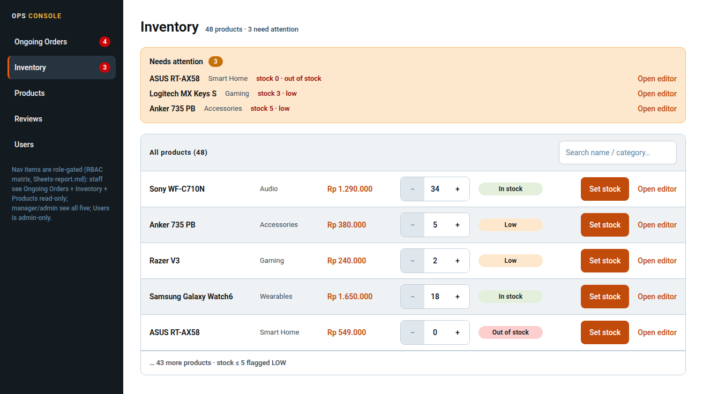

# Page: Inventory Dashboard — Design Spec (Sunset Glow)

Palette: `docs/color-tokens.md`. Roles: `Sheets-report.md`.
Typography & spacing per docs/design-tokens-round3.md (Roboto 400/500/600, 8pt grid, unified pill badges, filled CTA stack).
App shell & gutter (v4): `docs/control-panel/design.md` — the ops sidebar is a 230px `--ops-sidebar-w` token and the sidebar-to-content gutter is an explicit `.ops-content` padding (`--ops-page-pad` 32px desktop / 24px mobile), reset-proof by class specificity. This page's content sits 32px off the sidebar; its internal table/panel layout is unchanged by the shell spec.
Ops panel page. Access: **staff/manager/admin** (page-list column), with
matrix-driven feature gating inside:

| Feature | staff | manager | admin |
|---|---|---|---|
| Stock overview (read) | T | T | T |
| Replenishment alerts | T ("product update alerts") | T | T |
| Edit stock quantity | F | T | T ("update stock quantity") |
| Open product editor / review panel | F | T (links) | T (links) |

## FEATURES

- **Stock overview:** table of all products: name, category, price, current
  stock, status (in / low / out). "Low stock" threshold = 5 (assumption,
  consistent with Product Details; flagged).
- **Replenishment alerts:** items with stock ≤ threshold listed in a top
  "Needs attention" section. **Alert channel (open decision #1): TBD** — the
  sheet offers in-app badge/toast **or** email and defines no notification
  infra. Most likely v1: **in-app** — the dashboard IS the alert surface,
  plus a badge count on the ops nav ("Inventory (3)"). Email delivery is
  out of UI scope.
- **Stock editing UX (open decision #2): TBD** — inline edit on the table
  **or** via the edit-product form. Most likely v1: **inline quick-adjust on
  this page for the number only** (stepper) + "Open editor" link to Per
  Product Dashboard for anything else (name/price/image/description).
  Rationale: staff-level ops need fast number changes; full product CRUD is
  manager+ anyway. (UI builds both affordances cheaply; team decides the
  source of truth — no backend design here.)
- **Stock-decrement interaction (open decision #5): TBD** — if decrements are
  automatic on purchase (Sheet2 postcondition), manager edits set absolute
  values and the UI warns "stock is auto-decremented on each order — set
  actual count". If manual, same UI, different wording. Component
  `StockEditor` is copy-parameterized.
- **Route protection:** staff/manager/admin guard; staff additionally has
  write controls hidden (not just disabled — visibility gating, matrix F).

## LINKS / NAVIGATION

- Ops nav (shared `OpsSidebar`): Inventory Dashboard (this), Ongoing Orders,
  Per Product Dashboard, Per Product Review Panel, User Dashboard (admin
  item only — see that doc). Post-login routing: manager/admin land here.
- "Open editor" link → Per Product Dashboard (pre-filled product editor —
  the sheet's "pre-filled edit form").
- No storefront links (ops users don't shop).

## VISUALIZATION



> mockup.png rendered from _mockup-build/out/inventory-dashboard.html via headless Chromium @ 2026-09-22


ASCII wireframe (desktop — vertical 230px dark ops sidebar, not a top bar):

```
+------------------+-------------------------------------------------------+
| OPS CONSOLE      | INVENTORY        48 products · 3 need attention        |
|------------------+-------------------------------------------------------|
| Ongoing Orders [4]|| NEEDS ATTENTION [3]   (carrotOrange-100 banner)     |
| > Inventory [3]  ||  ASUS RT-AX58 · Smart Home · stock 0 · OUT [Open editor] |
| Products         ||  Logi MX Keys S · Gaming · stock 3 · LOW [Open editor]  |
| Reviews          ||  Anker 735 PB · Accessories · stock 5 · LOW [Open editor]|
| Users            |+-------------------------------------------------------|
| (foot: role-gated| ALL PRODUCTS (48)                 [ Search name / category… ]|
|  note)           |+-------------------------------------------------------|
|                  | | Sony WF-C710N | Audio | Rp 1.290.000 | [- 34 +] | In stock |
|                  | | Anker 735 PB  | Access| Rp 380.000   | [-  5 +] | Low |
|                  | | Razer V3      | Gaming| Rp 240.000   | [-  2 +] | Low |
|                  | … 43 more products · stock ≤ 5 flagged LOW            |
|                  | (row actions: [ Set stock ] [ Open editor ] right-aligned)|
+------------------+-------------------------------------------------------+
* ops nav items are role-gated: staff sees Ongoing Orders +
  Inventory(read-only) + Products(read-only); manager/admin all;
  User Dashboard = admin only.
```

Mobile (<768px): table → card list (one product per card, stepper inside);
alert banner collapses to a badge on the page title. Ops console is
desktop-first (staff workstation) — mobile is a supported-but-degraded view.

## COLOR USAGE

| Element | Token |
|---|---|
| Page canvas / table bg | `#FFFFFF` |
| Ops sidebar (shared `OpsSidebar`) | 230px vertical, `blueSlate-900` bg, `blueSlate-50` text; active item `blueSlate-800` bg + 3px `atomicTangerine-500` left bar, weight 600; alert badge (`nbadge`) `strawberryRed-600` fill, white 12/600 count; sidebar title 12/600, `.1em` tracking |
| "Needs attention" banner | `carrotOrange-100` bg + `carrotOrange-300` border, `blueSlate-950` text, count in `carrotOrange-600` badge (low-stock warning role per color-tokens §3; t_1007e199 handoff) |
| Table row border / zebra | `blueSlate-200`; zebra `blueSlate-50` |
| Status pill: in / low / out | `willowGreen-100` / `carrotOrange-100` / `strawberryRed-100` tints, text `blueSlate-900`, 12/600, padding 4×10 (no color-only conveyance: pill has label text — see below) |
| Stock stepper | 44px cells, `blueSlate-200` border, `blueSlate-950` value; disabled side `blueSlate-100` bg + `blueSlate-500` |
| "Open editor" link | `atomicTangerine-600` |
| "Set stock" quick action | filled `atomicTangerine-600` idle → `-700` hover → `-800` active, white 14/500 label, radius 8px |
| Save confirmation flash | `willowGreen-600` text on `willowGreen-100` row tint |
| Alert badge (nav `nbadge`) | `strawberryRed-600` bg, white count, 12/600 pill |

Pills always carry text labels ("In stock", "Low", "Out of stock") — status is
never color-only (a11y rule from ui-ux-pro-max).

## INTERACTIONS

(React: `InventoryDashboard`, `ProductTable`, `StockStepper`, `AlertBanner`.)

- **Idle (manager/admin):** steppers enabled. **Staff: steppers and "Open
  editor" hidden** (route + render gating, not disabled styling).
- **Stepper:** change commits on blur / Enter (`PATCH /products/:id/stock`
  — high-level assumption); success row tint `willowGreen-100` for ~1s;
  failure inline `strawberryRed-600` "Save failed — retry" link. Min 0.
- **Button state stack (round-3):** filled `atomicTangerine-600` idle →
  `-700` hover → `-800` active; disabled = `blueSlate-100` fill +
  `blueSlate-400` label; 44px min-height, 8px radius.
- **Alerts:** banner items sort out-of-stock first, then low, by stock asc;
  clicking a row scrolls to / expands its table row.
- **Search/filter inside table** (by name/category) — assumption, reuses
  `SearchInput` pattern from Search/Browse (debounced 300ms). Inputs: 44px
  min-height, 8px radius, `blueSlate-200` border, placeholder `blueSlate-500`,
  labels 13/600 `blueSlate-950`.
- **Loading:** static table skeleton rows (no shimmer loops; skeletons stay
  still under `prefers-reduced-motion`). **Error:** `strawberryRed` panel +
  retry.
- **Role-based visibility (summary):** staff = read-only + alerts;
  manager/admin = + steppers + editor links; User Dashboard nav item
  admin-only (separate doc).
- **a11y:** rows are `<tr>` with header scope; steppers have
  `aria-valuenow`; alert banner `role="alert"` on count change.
