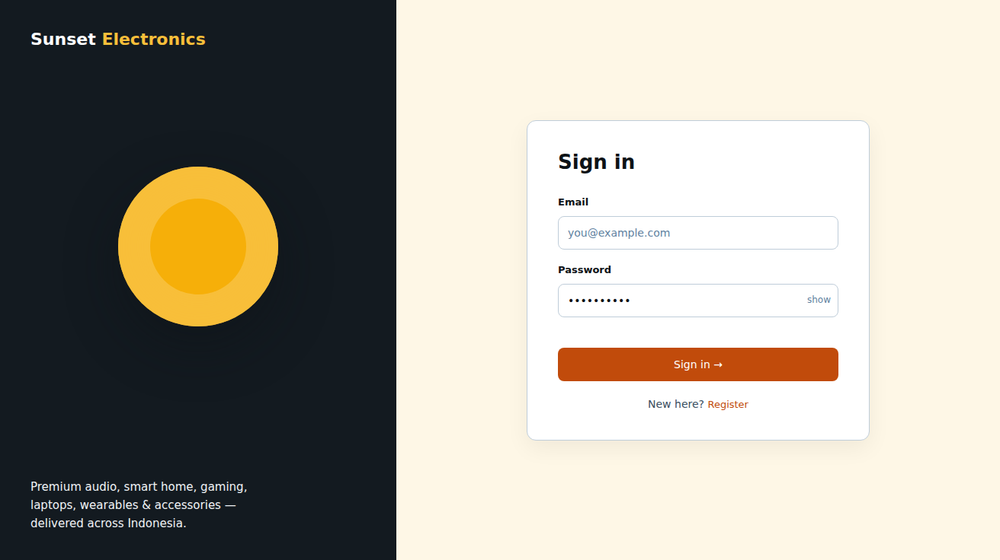

# Page: Login — Design Spec (Sunset Glow)

Palette: `docs/color-tokens.md`. Roles/permissions: `Sheets-report.md` RBAC matrix.
React component names are hints only — this is a design plan, not code.
Typography & spacing per `docs/design-tokens-round3.md` (Roboto 400/500/600, 8pt grid,
unified pill badges, filled CTA stack).

**SHARED LAYOUT (locked with Register, `docs/register/design.md`):** this page and Register share
one layout — the two-panel `AuthLayout` below (brand panel + form card, same logo placement,
typography, spacing, colors, and mobile collapse). They differ **only in the form** (sign-in
fields vs registration fields). The layout in this doc is identical to `docs/register/design.md`;
the layout in that doc is identical to this one.

## FEATURES

- Email + password sign-in for **all 4 roles** (matrix: login T for buyer/staff/manager/admin).
  The page is role-agnostic: one form; the server decides the role and routing.
- **Post-login routing (locked by the sheet):** buyer → Main Store; staff/manager/admin → dashboards.
  Role→dashboard mapping (assumption, flagged): staff → Ongoing Orders (core duty: order status +
  product alerts), manager/admin → Inventory Dashboard.
- No "remember me" / session duration spec in the sheet — **TBD** (most likely: normal session
  cookie; no UI implication for this page).
- No forgot-password flow in the sheet — out of scope; error copy must not imply one exists.
- **AuthLayout is shared with Register** — identical brand panel, logo placement, typography,
  and spacing; only the form and its copy differ (see shared-layout note in the header).
- Account-disabled users (admin can disable from User Dashboard): server denial state →
  "Account not available — contact an administrator" error banner.

## LINKS / NAVIGATION

- In-page: "New here? Register" → Register. Nothing else.
- Post-login: see routing above.
- Back/refresh always lands on Login. Authenticated users hitting Login are redirected to their
  role home.

## VISUALIZATION



> mockup.png rendered from _mockup-build/out/login.html via headless Chromium @ 2026-09-22

ASCII wireframe (desktop, ≥768px):

```
+--------------------------------------------------------------+
|  LOGO                                                         |
+---------------------------------+----------------------------+
|  (brand panel: blueSlate-900,   |   Email + password          |
|   tuscanSun sun shape)          |   +----------------------+   |
|                                 |   | Email                |   |
|  Tagline (blueSlate-50)        |   +----------------------+   |
|                                 |   +----------------------+   |
|                                 |   | Password         [show] |
|                                 |   +----------------------+   |
|                                 |   [ Sign in → ]  (primary)    |
|                                 |   New here? Register          |
+---------------------------------+----------------------------+
```

Mobile (<768px): brand panel collapses to a 64px top strip with the logo; card full-bleed with
24px gutters; minimum field height 44px.

## COLOR USAGE

> **60 : 30 : 10 mapping (round 7 · `design-tokens-round3.md` §11):** 60% dominant ground = `tuscanSun-50` #FEF7E6 (the warm page background, replacing the `#FFFFFF` canvas) · 30% secondary surface = `#FFFFFF` card/form-field fill (now reads as depth on the warm ground; `blueSlate-50` stays the alternate soft surface) · 10% accent = `atomicTangerine-600` (primary CTA) · `strawberryRed-600` (error) · `carrotOrange-500` (secondary) · `tuscanSun-500` (star/featured) — used sparingly, ~10% of the surface.
> **intended-redesign: round-7 60:30:10 storefront color ratio** — the `#FFFFFF` canvas is demoted to the 30% surface layer and the `tuscanSun-50` warm ground becomes the 60% dominant page background (`design-tokens-round3.md` §11). Auth pages take the same dominant-ground treatment for visual consistency. Control-panel / ops pages are **out of scope**.

| Element | Token |
|---|---|
| **Page background (60% ground)** | `tuscanSun-50` #FEF7E6 (warm ground, round 7 §11) — the form card sits on it as the 30% `#FFFFFF` surface; the dark brand panel `blueSlate-900` is unchanged (it is a panel, not the ground) |
| Brand panel (desktop) | `blueSlate-900` bg, `tuscanSun-400` sun graphic, `blueSlate-50` tagline |
| Card surface (30%) | `#FFFFFF` on the warm ground, border `blueSlate-200`, radius 12px |
| Labels / headings / input text | `blueSlate-950` (labels 13/600; "Sign in" heading 26/36 w600) |
| Input placeholder | `blueSlate-500` |
| Inputs | 44px min height, radius 8px, 1px `blueSlate-200` border; focus ring 2px `atomicTangerine-500`, offset 2; "show" toggle 12/500 `blueSlate-500` |
| Primary button ("Sign in →") | filled 44px: `atomicTangerine-600` idle → `-700` hover → `-800` active, white 14/500 label; disabled = `blueSlate-100` bg + `blueSlate-400` text |
| Register link | `atomicTangerine-600`, underline on hover |
| Error text / banner | `strawberryRed-600` on `strawberryRed-100`, border `strawberryRed-300` |

## INTERACTIONS

(React: shared `AuthLayout` two-panel container + brand panel; `LoginForm` on the form side;
`InputField`, `PrimaryButton` reused by Register — see `docs/register/design.md`.)

- **Idle:** fields empty; Submit disabled — `blueSlate-100` bg, `blueSlate-400`
  text (app-wide disabled rule).
- **Validation:** email required + format on blur; password required, min 8 chars (assumption —
  sheet only says "input validation" on Register; applying the same rule here). Inline errors
  under fields, `strawberryRed-600`, tied via `aria-describedby`.
- **Enabling logic:** Submit enabled only when email format valid AND password ≥8.
- **Hover/active (button):** filled 44px stack — `atomicTangerine-600` → `-700` hover →
  `-800` active, background-color 150ms only, no layout shift; link underlines.
- **Loading:** button label swaps to spinner + "Signing in…"; inputs disabled; double-submit guarded.
- **Error (server 401):** banner above form: "Email or password is incorrect."
  (`strawberryRed-100` bg, `strawberryRed-600` text, 1px `strawberryRed-300` border,
  `role="alert"`, focus moved to banner). 403 / disabled → "Account not available" variant.
- **Success:** redirect per routing table — navigation itself is the feedback; no toast.
- **Keyboard/a11y:** visible focus ring on every control; labels via `htmlFor`;
  `prefers-reduced-motion` respected for transitions.
