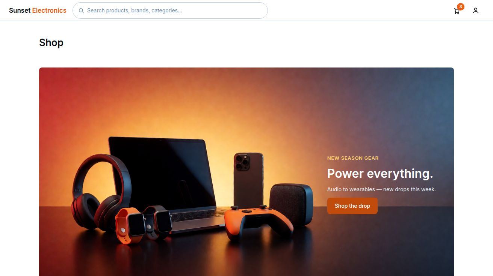
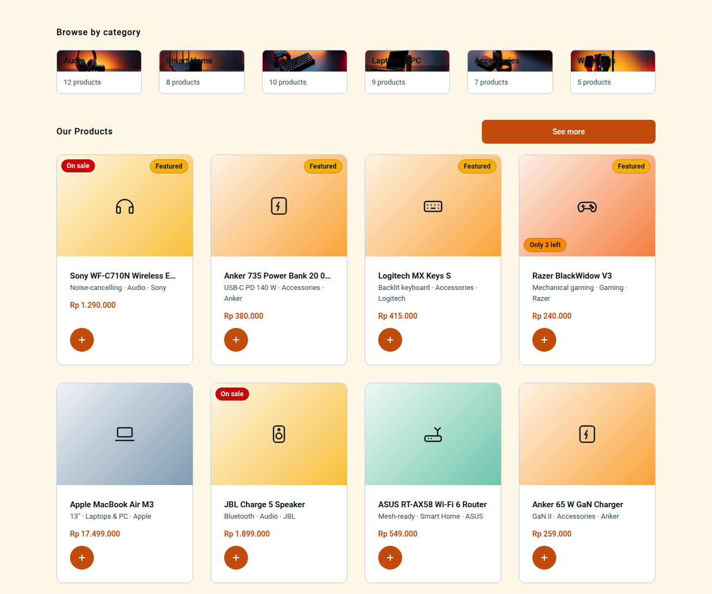

# Page: Main Store — Design Spec (Sunset Glow)

Palette: `docs/color-tokens.md`. Roles: `Sheets-report.md`.
Storefront page (buyer home). Shared shell: `StorefrontHeader` + `ProductCard` (defined here,
reused on Search/Browse and Product Details list contexts).
Typography & spacing per `docs/design-tokens-round3.md` (Roboto 400/500/600, 8pt grid,
unified pill badges, filled CTA stack).

## FEATURES

- Logged-in **buyer** home: single catalog grid; featured items appear in the same
  "Shop All" grid, marked only by the top-right "Featured" pill on their tile —
  there is **no separate featured strip** in round 3.
- **Hero banner (v4):** large promotional band at the top of the page, above
  category browsing. Asset = the AI-generated 16:9 still life
  `docs/main-store/hero-banner.png` (Sunset Glow lighting; right third of the
  image is clean gradient space — all copy is **overlaid HTML**, never baked
  into the image, so it stays crisp). Spec under VISUALIZATION.
- **Category browsing (v4, round-10 image row):** six clickable category IMAGES
  (Audio, Smart Home, Gaming, Laptops & PC, Accessories, Wearables) in one row
  between the hero and the "Our Products" grid. Each image is a 1200×300 still-life
  asset `docs/main-store/cat-<slug>.png` — **no text is baked into the images**: the
  category name and product count are HTML overlays on the tile, so they stay crisp.
  Each links to the Search/Browse filtered view. Page order (round-3 §3.5, extended):
  header → hero → Browse by category (image row) → Our Products (8-item, 2-row grid)
  → See-more on the heading row.
- **Role-gating note (sheet inconsistency, open decision #8):** the matrix grants
  "browse product" to buyer only, but "view product details" T for all roles and the
  implementation notes say the catalog page is "buyer & staff only". **TBD.** Most likely
  interpretation used here: storefront is buyer-only; staff/manager/admin never land on it —
  they post-login-route to ops pages. If the team decides staff may browse, the only change
  is the route guard (`buyer | staff`); layout is unchanged.
- Featured items: the "featured" flag lives on the product record (assumption — sheet says
  "catalog + featured items" without mechanics; most likely a flag set by manager/admin via
  Per Product Dashboard). Round 3 renders no dedicated strip: featured products sit in the
  single "Shop All" grid and carry the top-right `Featured` pill (`tuscanSun-500` fill,
  `blueSlate-950` text, 1px `tuscanSun-600` border).
- Every card links to Product Details; "Add to Cart" is a card action (matrix: buyer-only).
  **Sale badge (color-tokens §3):** when a product carries an active discount, the card
  shows a "−X%" / "On sale" badge — `strawberryRed-600` fill, white label, top-left.
  Badge data (sale flag + discount) comes from the product record; sale-flag mechanics are
  **TBD** (no sheet basis — most likely a manager/admin flag, consistent with the
  featured-flag assumption above).
- Infinite scroll or pagination — **TBD** (assume a "See more" load-more button for v1,
  simplest: filled 44px primary button centered under the grid; when the list is
  exhausted it is replaced by a 13px/400 `blueSlate-700` centered line
  "All N products shown" — not a disabled-looking button).
- Empty catalog state: message + icon (relevant for early launch; also the "no products in
  this view" fallback).

## LINKS / NAVIGATION

- `StorefrontHeader`: logo → Main Store; search input → Search/Browse (pre-filled query);
  cart icon → Cart (badge = item count); account menu → (buyer) Orders Placed, Logout.
  Staff+ are not expected here (see role-gating above); if present via mis-route, they see
  the catalog read-only with no cart/Cart link.
- **Category tile → Search/Browse filtered view (v4):** each tile deep-links
  `/search?category=<slug>` using the Search/Browse URL contract
  (`/search?query=&category=&brand=&priceMin=&priceMax=&sort=`):

  | Tile | Link |
  |---|---|
  | Audio | `/search?category=audio` |
  | Smart Home | `/search?category=smart-home` |
  | Gaming | `/search?category=gaming` |
  | Laptops & PC | `/search?category=laptops` |
  | Accessories | `/search?category=accessories` |
  | Wearables | `/search?category=wearables` |

  The active-category chip renders on the Search/Browse page like any other
  filter chip (removable, refetches in place) — no new route; the tile is the
  entry, the rail is the refinement.
- Card → Product Details.
- No order flow starts here; cart → Checkout → Orders Placed is documented in the Cart/Checkout docs.

## VISUALIZATION





> `mockup.png` = top viewport (1312×736): header + the full-bleed hero banner.
> `mockup-bottom.png` = everything **below the banner** (Browse-by-category image row,
> the "Our Products" 2-row product grid, and the "See more" button on the heading row),
> captured with the CDP clip harness `_mockup-build/capture_bottom.cjs` (region = from the
> hero's bottom edge to end-of-content; the banner itself is already shown by mockup.png).
> Both rendered from `_mockup-build/out/main-store.html` via headless Chromium.
> The page no longer has a "Shop" page title — the hero banner leads the page
> directly under the header, and the hero is **full-bleed** (edge-to-edge,
> no rounded outer corners, no side inset); the category image row and product grid
> below it stay in the centered `content-max` container.


ASCII wireframe (desktop, ≥1024px):

```
+------------------------------------------------------------------+
| Sunset Electronics [ pill search 44px min.... ]   (cart:3) (acct)|
+------------------------------------------------------------------+
+------------------------------------------------------------------+  <- FULL-BLEED
| HERO BANNER  (100vw, edge-to-edge, 16:9, NO rounded outer corners)|      hero
|  [hero-banner.png]   ── copy block, right third ──               |      image
|   eyebrow  "NEW SEASON GEAR"        (13/600, 0.05em track)      |      starts here
|   H1       "Power everything."          (32/40 w600 white)      |      (no "Shop"
|   sub      "Audio to wearables — new drops this week."           |       title above)
|             (14/20 w400, blueSlate-100)                         |
|   [ Shop the drop ]  (filled atomicTangerine-600, 44px)         |
+------------------------------------------------------------------+
  (centered content-max container resumes below the banner)
| Browse by category                     (section label 16/600)   |
| +---------+ +---------+ +---------+ +---------+ +---------+ +----+|
| | [cat-    | | [cat-   | | [cat-   | | [cat-   | | [cat-   | [cat|
| |  audio.  | |  smart- | |  gaming.| |  laptops| |  acces- |  wea|
| |  png]    | |  home.] | | .png]  | | .png]  | |  sories.]| rable|
| | Audio    | | Smart   | | Gaming  | | Laptops | |Accessor | es  |
| | [12]     | | Home[8] | | [10]    | |& PC[9]  | |ies[7]   | [5] |
| +---------+ +---------+ +---------+ +---------+ +---------+ +----+|
| (6 IMAGE tiles, 4:1, card-gutter 32px; label+count = HTML overlay,|
|  images text-free; mobile <768: horizontal-scroll row, min 240px) |
| Our Products                   [ See more ]  <- same heading row  |
| +--------+ +--------+ +--------+ +--------+                       |
| | [tile] | | [tile] | | [tile] | | [tile] |  grid4, 32px gutter  |
| |Sony C710| |Anker PB| |Logi MX | |Razer V3|  row 1: 4 featured  |
| +--------+ +--------+ +--------+ +--------+                       |
| | [tile] | | [tile] | | [tile] | | [tile] |                       |
| |MacBook | |JBL Chg | |ASUS RT | |Anker 65|  row 2: 1st 4 SHOP_ALL |
| +--------+ +--------+ +--------+ +--------+                       |
| desktop: exactly 8 items = 2 rows; the rest live behind the "See  |
| more" load-more affordance (data arrays stay intact)              |
+------------------------------------------------------------------+
```

> Round-8 note: the "Shop" page title was removed (the hero now leads the page
> under the header) and the hero banner is **full-bleed** — it is laid out
> *outside* the centered `.mstore` container, spanning 100vw edge-to-edge with
> no rounded outer corners. `mockup.png` (top viewport) shows header + the
> full-bleed banner; `mockup-bottom.png` (CDP clip from the hero's bottom edge
> to end-of-content) shows the Browse-by-category image row + Our Products grid
> + "See more" on the heading row — the region the single 736px top shot
> previously cut off.

> **intended-redesign (round 10):** the v4 category section (swatch + 40px glyph
> card tiles, `.cat-tile`/`.cat-swatch`/`.cat-label`/`.cat-count`) was
> intentionally redrawn as a row of 6 clickable **images** (`cat-<slug>.png`,
> 1200×300, **no baked-in text** — label + count are HTML overlays), the "Shop
> All" heading was renamed **"Our Products"** (keeping `id="shop-all"`), the
> "See more" button moved from its centered-bottom position onto the "Our
> Products" heading row (right side, `space-between`), and the grid now renders
> exactly 8 items (4 featured + first 4 of SHOP_ALL = 2 desktop rows) with the
> rest kept in the data arrays behind the load-more affordance. Framework-safe:
> every color stays an in-scale Sunset Glow token, weights ≤ 600, spacing on the
> 8pt grid with framework-exempt component px — a page-content change, not a
> framework change.

> **intended-redesign (v4):** the v3 "single Shop All grid" wireframe lines above
> were intentionally redrawn into the v4 layout — header → hero banner → Browse
> by category (six-tile rail) → Shop All → load-more (the round-3 §3.5 order,
> extended with the v4 hero + category browsing). The v3 framework is **not**
> eroded: every color is still an in-scale Sunset Glow §1 token, font weights
> stay ≤ 600, and spacing stays on the 8pt grid with the framework-exempt
> component px. The v4 hero banner, six-tile category rail, and the panel
> 32/24px gutter are *structure* additions only; every value they use snaps to
> the immutable v3 framework tokens in `docs/design-tokens-round3.md` and
> `docs/color-tokens.md` (locked at 17da448). See VISUALIZATION below for the
> concrete v4 values and their v3 token sources.

### Hero banner (v4) — concrete values

- **Container:** full content width (1200px max at desktop), `border-radius: 8px`,
  `overflow: hidden`, `position: relative`. Height: **auto from aspect-ratio** —
  `aspect-ratio: 16/9` matches the 1312×736 asset exactly; at 1200px content width the
  band is 675px tall. No `min-height` hack, no fixed px height (keeps CLS at 0 —
  the browser reserves the box from the aspect ratio before the image loads).
- **Image:** `` (copied into the build's
  static assets as `hero-banner.png`), `position: absolute; inset: 0; width: 100%;
  height: 100%; object-fit: cover; object-position: center right;` — the dark right
  third stays under the copy. `loading="eager"` (it's the LCP element),
  `fetchpriority="high"`.
- **Copy overlay:** absolutely positioned block in the **right third**:
  `position: absolute; right: 48px; top: 50%; transform: translateY(-50%);
  max-width: 380px; text-align: left;`. Stack top→bottom with 12px gaps:
  1. Eyebrow `NEW SEASON GEAR` — 13/600, 0.05em tracking, `tuscanSun-300` (#FACF6B —
     warm over the dark blue-slate corner; ≈ 11.9:1 vs `blueSlate-900` #131A20,
     12.7:1 vs `blueSlate-950` #0D1216 ✓ AAA).
     Sentence-case rule: the label itself is short all-caps by style, tracking .05em.
  2. H2 `Power everything.` — 32/40 w600 `#FFFFFF` (the page H1 "Shop" above stays
     26/36; the hero is display size, **32px is a v4 addition to the type scale**,
     one-off, not a new token). White on the image's right-third blue-slate,
     ≈ `blueSlate-900`–`blueSlate-950` lightness (`#131A20`–`#0D1216`): 17.6:1–18.8:1 ✓ AAA.
  3. Sub `Audio to wearables — new drops this week.` — 14/20 w400 `blueSlate-100`
     (#DFE6EC), 14.95:1 vs the dark corner ✓.
  4. CTA `Shop the drop` — **filled primary** (`atomicTangerine-600` → `-700` hover →
     `-800` active, white 14/500, 44px, radius 8px, padding 0 20px). Links to
     `#shop-all` (in-page scroll to the grid) — the hero CTA is an anchor, not a
     route.
  - **Gradient scrim (only if the copy ever lands over a lighter zone):** if a
    future banner asset changes the right-third darkness, add
    `background: linear-gradient(90deg, transparent 45%, rgba(13,18,22,.55) 78%)`
    behind the copy block. Against the **current asset the scrim is not needed** —
    the right third is already the darkest zone (verified: left = light
    orange-red, center = medium, right = dark blue-slate).
- **Mobile (<768px):** band `aspect-ratio: 16/9` still applies; copy block becomes
  **static flow** at the bottom of the band: `position: absolute; inset: auto 16px 16px;
  top: auto;` with the CTA full-width 44px, H2 → 26/36 (the page-H1 size), max-width
  100%. Sub-clamps to 2 lines.
- **Image-failure state:** `onerror` → band collapses to a 160px `atomicTangerine-50`
  background with the eyebrow + H2 + CTA in `blueSlate-950`; the copy block is HTML,
  so it survives the image missing (degradation, not blank).
- **Alt text:** `"Sunset Glow: headphones, smartwatches, laptop, phone, speaker and
  game controller on a dark reflective surface"` — descriptive of the product set,
  not of the marketing copy (that's the HTML's job).

### Category browsing block (v4 → round-10 image row)

- **Section label:** `Browse by category` — round-3 `section-header` (16/24 w600,
  0.05em tracking, sentence case), `section-label-gap` 20px below the hero.
- **Tile (round-10 — images replaced the v4 swatch+glyph cards):** 6-image row,
  `display: grid; grid-template-columns: repeat(6, minmax(0, 1fr)); gap: var(--card-gutter)`.
  Each tile = link (`<a class="cat-strip" href="/search?category=<slug>"`),
  `border-radius: 8px`, `border: 1px solid blueSlate-200`, `overflow: hidden`, 1px
  border transition 150ms, white tile background:
  1. **Image:** `.png">` — 1200×300 (4:1) still-life
     asset, `width: 100%; aspect-ratio: 4/1; object-fit: cover`, wrapped in a
     `position: relative` `.cat-cimg`. **No text is baked into the images** —
     the category name is an HTML overlay (same crisp-text treatment as the hero
     banner copy), `alt` = the category name.
     Assets (6, all committed under `docs/main-store/`): `cat-audio.png`,
     `cat-smart-home.png`, `cat-gaming.png`, `cat-laptops.png`, `cat-accessories.png`,
     `cat-wearables.png`.
  2. **Label overlay:** `card-title` 15/24 w600 `blueSlate-950`, absolutely positioned
     bottom-left **over the image** (`left: 12px; bottom: 8px`), sentence case
     ("Laptops & PC"), with a subtle `blueSlate-950`-based text-shadow so it stays
     gradient-safe and crisp over any part of the image.
  3. **Count line:** `metadata` 13/20 w400 `blueSlate-700` — "12 products",
     an HTML line **below the image** on the white tile background
     (`padding: 10px 12px`). Counts are server-provided live aggregates; the
     mockup values (12/8/10/9/7/5) are illustrative. A 0-product category still
     shows its tile and the live link (the Search/Browse empty state handles it) —
     **TBD-light** as before.
- **Tile states:** hover = border → `atomicTangerine-400` (same affordance as the old
  cat-tile; color-only-safe). Focus ring 2px `atomicTangerine-500` offset 2.
- **Mobile (<768px):** the row becomes **horizontally scrollable**
  (`overflow-x: auto`, 24px gutter, tile `min-width: 240px`, `flex: none`).
  No vertical wrap. The "Our Products" heading row stacks `column` on <768px so
  the full-width "See more" button sits under the label.

Mobile (<768px): header wraps — logo left, cart + account right, search drops to its own
line below (44px min); grid 3-up at 768–1023px, 2-up at 390–767px (24px gutter), 1-up at
<390px; "See more" becomes full-width. When exhausted: centered 13/400 `blueSlate-700`
"All N products shown" line replaces the button.

## COLOR USAGE

> **60 : 30 : 10 mapping (round 7 · `design-tokens-round3.md` §11):** 60% dominant ground = `tuscanSun-50` #FEF7E6 (the warm page background, replacing the `#FFFFFF` canvas) · 30% secondary surface = `#FFFFFF` card/panel/form-field fill (now reads as depth on the warm ground; `blueSlate-50` stays the alternate soft surface) · 10% accent = `atomicTangerine-600` (primary CTA / price) · `strawberryRed-600` (sale / error / destructive) · `carrotOrange-500` (low-stock / secondary) · `tuscanSun-500` (featured / star) — used sparingly, ~10% of the surface.
> **intended-redesign: round-7 60:30:10 storefront color ratio** — the `#FFFFFF` canvas is demoted to the 30% surface layer and the `tuscanSun-50` warm ground becomes the 60% dominant page background (`design-tokens-round3.md` §11). Control-panel / ops pages are **out of scope**: their dark `blueSlate-900` sidebar + content gutter chrome is unchanged.

| Element | Token |
|---|---|
| **Canvas / page background (60% ground)** | `tuscanSun-50` #FEF7E6 (warm ground, round 7 §11 — replaces the `#FFFFFF` canvas; `#FFFFFF` is now the 30% surface on the header, cards, and panels) |
| Header (56px) bg / border | `#FFFFFF` / `blueSlate-200` |
| Logo | `blueSlate-950` 17/600, "Electronics" accent span `atomicTangerine-500` |
| H1 "Shop" | `blueSlate-950` 26/36 w600 |
| **Hero band (v4)** | container: full content width, `aspect-ratio: 16/9`, radius 8px, overflow hidden; `hero-banner.png` absolute inset cover, `object-position: center right`, `loading="eager"`; band sits `section-rhythm` (48px) below the H1, `section-rhythm` above "Browse by category" |
| **Hero copy overlay (v4)** | right third (`right: 48px; top: 50%; translateY(-50%); max-width: 380px; text-align: left`, 12px stack gaps): eyebrow `NEW SEASON GEAR` 13/600 .05em `tuscanSun-300` (#FBDF9D, ≥4.5:1 vs the band's dark blue-slate corner); H2 `Power everything.` **32/40 w600 `#FFFFFF`** (v4 display size, one-off — not a new type token); sub 14/20 w400 `blueSlate-100`; CTA `Shop the drop` filled primary stack (`atomicTangerine-600/700/800`, white 14/500, 44px, radius 8px) anchoring to `#shop-all`; on <768px the copy drops to bottom-left static flow, H2 → 26/36, CTA full-width |
| **Category image tile (round-10)** | link `cat-strip`, white bg, radius 8px, 1px `blueSlate-200` border (hover → `atomicTangerine-400`), `overflow: hidden`, `repeat(6, minmax(0,1fr))` + `card-gutter` 32px (mobile: horizontal-scroll row, 24px gutter, tile min-width 240px); image = 1200×300 (4:1) `cat-<slug>.png` `object-fit: cover`, **no baked-in text** — category name overlay `card-title` 15/24 w600 `blueSlate-950` bottom-left over the image (`left: 12px; bottom: 8px`, text-shadow for gradient-safe crispness) + count line `metadata` 13/20 w400 `blueSlate-700` **below** the image on the white tile (`padding: 10px 12px`), "N products" (live aggregate; example: 12/8/10/9/7/5) |
| **Section row "Our Products" + "See more" (round-10)** | `id="shop-all"` heading row = `display: flex; justify-content: space-between; align-items: center`, `section-label-gap` below the category row: label "Our Products" `blueSlate-950` 16/24 w600, letter-spacing .05em, sentence case (left) + "See more" filled 44px primary button 320px (right; full-width mobile — the row stacks `column` on <768px). The section renders exactly 8 items (4 FEATURED + first 4 of SHOP_ALL) = 2 grid4 rows on desktop; the remaining products stay in the data arrays behind the "See more" affordance |
| Section label "Browse by category" | `blueSlate-950` 16/24 w600, letter-spacing .05em, sentence case |
| Card: bg / border / hover border | `#FFFFFF` / `blueSlate-200` / `atomicTangerine-400` |
| Card title | `blueSlate-950` 15/24 w600, 1-line clamped + ellipsis |
| Card subline (feature · category · brand) | `blueSlate-700` 13/400 |
| Card price | `atomicTangerine-600` 14/20 w600 |
| Strike price (sale original) | `blueSlate-600` 13/400, line-through |
| "On sale" pill | `strawberryRed-600` fill, white label, top-left (color-tokens §3) |
| "Featured" pill | `tuscanSun-500` fill, `blueSlate-950` label, 1px `tuscanSun-600` border, top-right |
| "Only N left" pill | `carrotOrange-500` fill, `blueSlate-950` label, 1px `carrotOrange-600` border, bottom-left |
| "Out of stock" pill | `strawberryRed-100` bg, `strawberryRed-700` label; tile at opacity .4 |
| Product tile | 4:3, 135° category-keyed gradient (Audio `tuscanSun-50→400`, Smart Home `seagrass-50→400`, Gaming `atomicTangerine-50→400`, Laptops & PC `blueSlate-50→400`, Accessories `carrotOrange-50→400`, Wearables `strawberryRed-50→400`); single 40px stroke-1.5 `blueSlate-900` line glyph, decorative (`aria-hidden`) |
| Add-to-cart | 44×44 circular filled `atomicTangerine-600`, white plus glyph → hover `-700` → active `-800`; disabled = `blueSlate-100` bg + `blueSlate-400` glyph |
| Cart badge | `atomicTangerine-500` bg, white 12/600 number (**TBD: open decision #3**, cart color accents) |
| "See more" (load more) | filled 44px primary button, 320px wide desktop / full-width mobile (round-10: sits on the "Our Products" heading row, right-aligned via `space-between`; on <768px the row stacks so it becomes full-width); when exhausted → 13/400 `blueSlate-700` centered "All N products shown" line, not a disabled button |

## INTERACTIONS

(React: `StorefrontHeader`, `ProductCard`, `ProductGrid`, `CartIcon`.)

- **Idle:** cards static, 32px gutters desktop / 24px mobile (section rhythm 48px / 40px);
  equal card height per row (`min-height` 300px, CTA row pinned to the card bottom).
  Hero band + category image row are static on first paint (no entrance animation — v1;
  scroll-reveal is a v2 polish, **TBD-light**). Category row on mobile: horizontal
  touch-scroll, no snap in v1; edge fade (24px gradient `transparent → #FFFFFF`) hints
  scrollability.
- **Hero CTA:** `Shop the drop` smooth-scrolls to `#shop-all` (the "Our Products"
  heading row gets `id="shop-all"`, `scroll-margin-top: 80px` for the sticky header);
  `prefers-reduced-motion` → instant jump.
- **Category image tile:** hover/focus as in the visual spec; click navigates to
  `/search?category=<slug>` — the Search/Browse page renders that category chip
  active in its results row, and the filter rail's Category section shows it
  selected. No in-page refetch; it's a route.
- **Hover (card):** border → `atomicTangerine-400`, subtle 2px lift; no layout shift.
- **Add to Cart:** optimistic — badge count increments, button flashes `willowGreen-500`
  check for ~600ms. On API failure (e.g. stock just ran out, high-level `POST /cart/items`)
  → toast `strawberryRed-600` "Couldn't add to cart — stock changed. Reload." Card flips to
  out-of-stock state.
- **Loading:** grid skeletons (`blueSlate-100` blocks matching tile/title/price/CTA shape,
  **static — no shimmer**) while `GET /products` in flight; `prefers-reduced-motion` kills
  all transitions.
- **Empty:** centered illustration-free state: "No products yet" + `blueSlate-700` helper
  line + one primary CTA (buyer sees this only at launch).
- **Error (API 5xx):** inline panel `strawberryRed-100` bg, `strawberryRed-700` text, with
  "Try again" filled button (`strawberryRed-600` fill, white label).
- **Stock state on cards:** `stock === 0` → tile at 40% opacity + "Out of stock" pill
  (`strawberryRed-100` bg, `strawberryRed-700` text) and add-to-cart disabled
  (`blueSlate-100` bg, `blueSlate-400` glyph, `aria-disabled`).
  Stock 1–5 → "Only N left" pill, bottom-left (`carrotOrange-500` fill, `blueSlate-950`
  text, 1px `carrotOrange-600` border) — urgency cue, assumes stock is exposed publicly —
  most likely interpretation.
- **Role-based visibility:** staff/manager/admin hitting this route (if allowed per TBD
  above) see read-only cards: no Add-to-Cart button, no cart badge in header.
- **Keyboard/a11y:** cards focusable (focus ring 2px `atomicTangerine-500`, offset 2);
  add-to-cart is a real `<button aria-label="Add <name> to cart">`; touch targets ≥ 44×44px.
