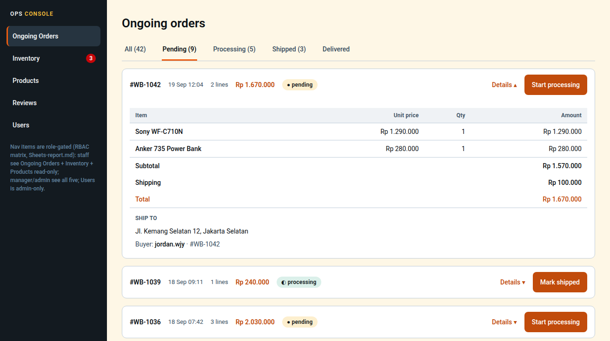

# Page: Ongoing Orders — Design Spec (Sunset Glow)

Palette: `docs/color-tokens.md`. Roles: `Sheets-report.md`.
Typography & spacing per docs/design-tokens-round3.md (Roboto 400/500/600, 8pt grid, unified pill badges, filled CTA stack).
App shell & gutter (v4): `docs/control-panel/design.md` — the ops sidebar is a 230px `--ops-sidebar-w` token and the sidebar-to-content gutter is an explicit `.ops-content` padding (`--ops-page-pad` 32px desktop / 24px mobile), reset-proof by class specificity. This page's content sits 32px off the sidebar; its internal table/panel layout is unchanged by the shell spec.

> **Round-7 scope note (out of scope — layout unchanged):** the round-7
> 60:30:10 storefront color-ratio change (`design-tokens-round3.md` §11 — warm
> `tuscanSun-50` #FEF7E6 dominant ground) applies **only to the buyer-facing
> storefront**. This ops page is **out of scope for layout changes**: the dark
> `blueSlate-900` sidebar + `.ops-content` gutter stay exactly as
> `docs/control-panel/design.md` specifies. If the `.ops-content` area sits on
> the warm ground, that is acceptable; the panel chrome is unchanged.

Access: **staff/manager/admin** (matrix: "update purchase status" F/T/T/T;
page list = staff/manager/admin). This is the **fulfillment console** — the
ops mirror of Orders Placed.

## FEATURES

- Queue of open orders, filtered by default to `pending` + `processing`
  ("ongoing"); tabs to widen: All / Pending / Processing / Shipped /
  Delivered (recent, read-only audit).
- **Status update control (the page's core action):** per-order
  advance button `PATCH /orders/:id/status` (high-level assumption) —
  pending → processing → shipped → delivered (locked machine). Buttons
  label as "Start processing" / "Mark shipped" / "Mark delivered".
  Regression allowed? **TBD** (assume forward-only for v1 — shipping
  workflow is one-directional; a manager can later decide to allow
  rollback via a "Revert" secondary action — flagged, not designed in
  depth).
- Order detail expand: lines, address, buyer contact — needed for picking/
  hand-off.
- **Domain examples (electronics):** expanded detail shows line models +
  quantities (e.g. "Anker 735 Power Bank ×1, Logitech MX Keys S ×2"); no fields
  beyond the sheet's locked set (lines, address, buyer contact).
- **Receipt-style detail (round 9):** the expanded detail is a receipt table,
  not a single summary line — itemized rows (Item, Unit price, Qty, Amount —
  amount columns right-aligned), then Subtotal / Shipping / Total rows (Total in
  `atomicTangerine-600`), then a Ship-to block (address + buyer contact) below
  the table, all inside the existing white order card. `#WB-1042` is expanded
  by default in the mockup to show the receipt; all other rows collapse to
  "Details ▾".
- **Staff capability boundary:** staff can advance status and see alerts
  (their whole scope: "daily transaction ops: order status, product
  alerts"). No product CRUD, no review moderation, no user management —
  this page exposes nothing beyond status advancement.
- **Alerts (open decision #1): TBD** — most likely in-app: an "Orders
  need attention" count badge on the ops nav (e.g. pending > N hours).
  No email infra in the sheet; out of UI scope.

## LINKS / NAVIGATION

- Ops nav "Ongoing Orders". Post-login routing: **staff land here**
  (most likely interpretation, flagged in the Login doc).
- Order id → deep-link `/ops/orders/:id`.
- No links to storefront; buyer names are plain text (links to
  User Dashboard would be admin-only scope — **do not link**).

## VISUALIZATION



> mockup.png rendered from _mockup-build/out/ongoing-orders.html via headless Chromium @ 2026-09-23 (round-9 receipt-table refresh)


ASCII wireframe (desktop, list variant — assumption, kanban is a flagged alt;
vertical 230px dark ops sidebar, not a top bar):

```
+------------------+-------------------------------------------------------+
| OPS CONSOLE      | Ongoing orders                                        |
|------------------+-------------------------------------------------------|
| > Ongoing Orders | All(42)  Pending(9)  Processing(5)  Shipped(3)  Delivered |
| Inventory [3]    |+-------------------------------------------------------|
| Products         | | #WB-1042 · 19 Sep 12:04 · 2 lines · Rp 1.670.000 [● pending] |
| Reviews          | |   [ Start processing ]   [ Details ▴ ]             |
| Users            | |   +-------------------------------------------+   |
|                  |   | Item              | Unit price | Qty | Amount |   |
|                  |   | Sony WF-C710N     | 1.290.000  |  1 | 1.290.000|   |
|                  |   | Anker 735 PB      | 280.000    |  1 | 280.000  |   |
|                  |   | Subtotal          |            |    | 1.570.000|   |
|                  |   | Shipping          |            |    | 100.000  |   |
|                  |   | Total             |            |    | 1.670.000|   |
|                  |   | SHIP TO: Jl. Kemang Selatan 12, Jakarta Selatan     |   |
|                  |   | Buyer: jordan.wjy · #WB-1042                    |   |
|                  |   +-------------------------------------------+   |
|                  |+-------------------------------------------------------|
|                  | | #WB-1039 · 18 Sep 09:11 · 1 lines · Rp 240.000 [◐ processing] |
|                  | |   [ Mark shipped ]      [ Details ▾ ]                |
|                  | Queue sorted by age · status advances forward-only      |
+------------------+-------------------------------------------------------+
```

Mobile (<768px): cards stack; filter tabs scroll horizontally; expand
details in place. The receipt table tightens its cell padding to 8px so all
four columns (Item / Unit price / Qty / Amount) stay on one row at 390px —
verified no horizontal overflow; order header rows wrap (flex-wrap) rather
than clip.

## COLOR USAGE

| Element | Token |
|---|---|
| Canvas / card border | `#FFFFFF` / `blueSlate-200` |
| Ops sidebar (shared `OpsSidebar`) | 230px vertical, `blueSlate-900` bg, `blueSlate-50` text; active item `blueSlate-800` bg + 3px `atomicTangerine-500` left bar, weight 600 |
| Status chips (pending/processing/shipped/delivered) | 12/600 pill chips, padding 4×10, per color-tokens §3: `tuscanSun-100` / `seagrass-100` / `blueSlate-100` / `willowGreen-100` tints, text `blueSlate-900` |
| Advance button (primary per row) | filled `atomicTangerine-600` idle → `-700` hover → `-800` active, white 14/500 label, 44px min-height, 8px radius; disabled = `blueSlate-100` fill + `blueSlate-400` label |
| "Details" toggle | `atomicTangerine-600` link |
| Receipt table header row (`.receipt th`) | `blueSlate-50` bg, 12/600 `blueSlate-700` label, 1px `blueSlate-200` divider below |
| Receipt item rows / totals rows | 14/20 Roboto 400; item name weight 500; Subtotal/Shipping weight 500 `blueSlate-950`; Total row weight 500 in `atomicTangerine-600` (frame cap: font-weight ≤ 600); 1px `blueSlate-200` row dividers (none under last row) |
| Ship-to block (`.receipt .ship`) | 12/600 uppercase `blueSlate-700` "SHIP TO" label; address 14/20 `blueSlate-950`; buyer line 14/20 `blueSlate-700` with name weight 500; 1px `blueSlate-200` top divider |
| Filter tabs active / idle | active `atomicTangerine-500` 3px underline + `blueSlate-950` text, weight 600; idle `blueSlate-700`, weight 500 |
| Success flash (row after advance) | `willowGreen-100` row tint, `willowGreen-600` text |
| Failure toast / banner | `strawberryRed-100` bg, `strawberryRed-600` text |
| Attention badge (nav `nbadge`) | `strawberryRed-600` bg, white 12/600 count pill |

## INTERACTIONS

(React: `OngoingOrders`, `OrderQueue`, `OrderRow`, `StatusAdvanceButton`.)

- **Idle:** queue sorted by age (oldest pending first — fulfillment
  priority; flagged assumption vs newest-first). Status advances
  forward-only (pending → processing → shipped → delivered).
- **Advance:** optimistic: chip + button move forward, success flash;
  on 409/5xx → `strawberryRed` toast "Status update failed — retry",
  button stays. Double-advance guarded (button disabled mid-flight;
  disabled state = `blueSlate-100` fill + `blueSlate-400` label).
- **Button state stack (round-3):** filled `atomicTangerine-600` idle →
  `-700` hover → `-800` active; 44px min-height, 8px radius.
- **Loading:** static row skeletons (no shimmer loops; skeletons stay
  still under `prefers-reduced-motion`); status refetches on focus + 30s poll
  (assumption, TBD-light — mirrors Orders Placed polling).
- **Error (page):** `strawberryRed` panel + retry.
- **Disabled logic:** delivered orders show no advance button (terminal
  state) — read-only audit row instead.
- **Role-based visibility:** staff/manager/admin all see status buttons
  (all three have "update purchase status" T); nothing on this page is
  admin-exclusive. Manager additionally reaches Products/Reviews nav
  items (separate pages).
- **a11y:** status conveyed by chip text + icon (never color-only);
  advance buttons text-labelled; queue changes via `aria-live="polite"`.
