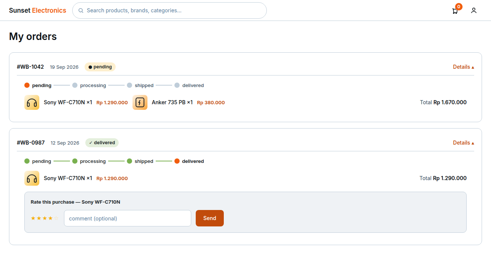

# Page: Orders Placed — Design Spec (Sunset Glow)

Palette: `docs/color-tokens.md`. Roles: `Sheets-report.md`.
Order-flow step 3 (Cart → Checkout → **Orders Placed**). Also the buyer's order
history + status tracking page, and — per the sheet's implementation notes —
**home of the review form** (open decision #9 noted in Product Details).
Typography & spacing per `docs/design-tokens-round3.md` (Inter 400/500/600, 8pt grid,
unified pill badges, filled CTA stack).

## FEATURES

- Buyer-only for order data ("check purchase status" T for buyer; "update purchase
  status" F for buyer → **read-only** on everything here).
- Order list (newest first): order id, date, line summary, **status chip** using
  the locked machine `pending → processing → shipped → delivered` (chip colors
  per color-tokens §3; all chips carry a text label, never color-only).
- Order detail expand: lines, status **timeline** (4 steps, 14px dots — current
  step `atomicTangerine-500`, completed `willowGreen-500`, upcoming `blueSlate-200`;
  connecting lines 44px wide, `willowGreen-500` where done), plus product
  thumbnails + line prices + total.
- **Review form (sheet: "review form lives here"; open decision #9):** for each
  order in `delivered` status, a "Rate this purchase" block per purchased
  product: star rating + optional comment, in a `blueSlate-50` inset card.
  (matrix: "review products bought"
  buyer-only; reviews only for purchased items — locked). Rating scale
  **TBD (open decision #10)** — assume 1–5 stars, component `ReviewForm`
  scale-agnostic.
  - **Stock-decrement note (open decision #5):** no UI consequence here; if
    decrement is later manual, nothing on this page changes (buyer still
    read-only).
- Buyer cannot PATCH status (matrix: update purchase status F for buyer).
  UI: zero status-edit affordances; staff/manager/admin never see this page.

## LINKS / NAVIGATION

- Arrival: post-checkout redirect (confirmation landing — the just-placed order
  is at top, `pending`). Header account menu → "My orders".
- Line → Product Details (re-shop / inspect).
- No exit-link to checkout; the order flow is one-directional.

## VISUALIZATION




ASCII wireframe (desktop):

```
+------------------------------------------------------------------+
| Sunset Electronics [ search........ ]  (cart:0)  (account)       |
+------------------------------------------------------------------+
| My orders                                                       |
| +--------------------------------------------------------------+|
| | #WB-1042  19 Sep 2026  [● pending]              [Details ▴] ||
| | pending → processing → shipped → delivered (14px dots)      ||
| | [40px] Sony WF-C710N ×1 Rp1.29jt  [40px] Anker 735 PB ×1 Rp380k  Total Rp1.67jt |
| +--------------------------------------------------------------+|
| | #WB-0987  12 Sep 2026  [✓ delivered]          [Details ▴]   ||
| | timeline (all done: willowGreen-500 dots)                    ||
| | [40px] Sony WF-C710N ×1 Rp1.29jt   Total Rp 1.290.000       ||
| | +----------------------------------------------------------+ ||
| | | Rate this purchase — Sony WF-C710N                        || |
| | | [★★★★☆] [ comment (optional) .......... ] [ Send ]       || |
| | +----------------------------------------------------------+ ||
| +--------------------------------------------------------------+|
```

Mobile: cards full-width; timeline compresses to a horizontal 4-dot strip; the
review block goes full-width inside its card (no bottom sheet in round 3).

## COLOR USAGE

| Element | Token |
|---|---|
| Canvas / card border | `#FFFFFF` / `blueSlate-200`, radius 12px; card rows 16px 20px padding, 44px min header row |
| Order id / date | `blueSlate-950` 14/600 / `blueSlate-700` 13/400 |
| Status chips (pending/processing/shipped/delivered) | per color-tokens §3: `tuscanSun-100` / `seagrass-100` / `blueSlate-100` / `willowGreen-100` fills, `blueSlate-900` 12/600 label (● / ✓ glyph inside the pill) |
| Timeline: done / current / upcoming | 14px dots `willowGreen-500` / `atomicTangerine-500` / `blueSlate-200`; 44px connector lines `blueSlate-200` (`willowGreen-500` where done); step labels `blueSlate-700` 13/500, current step `blueSlate-950` w600 |
| Line thumbs / names / prices | 40×40 category-keyed gradient tiles; `blueSlate-950` 14/500 name, `atomicTangerine-600` 13/20 w600 price; "Total" `blueSlate-700` label + `blueSlate-950` w600 value |
| "Details" toggle | `atomicTangerine-600` 14/500, underline on hover |
| Stars (rate form) | filled `tuscanSun-500` / empty `tuscanSun-200` (**TBD: open decision — star-rating colors**) |
| Review block | `blueSlate-50` bg, 1px `blueSlate-200` border, radius 10px; comment input 44px min, 1px `blueSlate-200` border, placeholder `blueSlate-500` |
| "Send" button | filled 44px primary: `atomicTangerine-600` → `-700` hover → `-800` active, white 14/500 label |
| Review-sent confirmation | `willowGreen-600` text on `willowGreen-100` tint |

## INTERACTIONS

(React: `OrdersPlaced`, `OrderCard`, `StatusTimeline`, `ReviewForm`, `StarRating`.)

- **Idle:** list loads; each order card collapsed to a single row until expanded
  (first / just-confirmed order auto-expanded — post-checkout context).
- **Status change:** when the server advances an order, the page polls or
  refetches (assumption: refetch on focus + 60s poll — TBD, lightweight);
  timeline + chip animate forward; `aria-live="polite"` announcement "Order
  WB-1042 is now processing".
- **Review form:** appears only when status = delivered AND not yet rated
  (server flag `reviewed`). Stars: hover fills to cursor, click sets;
  submitting with 0 stars → inline `strawberryRed-600` "Please pick a rating".
  Success → block replaced by "Thanks — you rated Sony WF-C710N ★★★★☆"
  (`willowGreen-600`), non-re-openable for that item.
- **Disabled states:** review block absent for pending/processing/shipped
  (purchase not complete — most likely interpretation; can be flipped to
  "after delivery", that IS delivered here).
- **Loading:** static row skeletons (`blueSlate-100` blocks — no shimmer;
  `prefers-reduced-motion` honored). **Error:** `strawberryRed-100` bg /
  `strawberryRed-700` text panel + "Try again" filled `strawberryRed-600` button.
- **Empty:** "No orders yet" + "Start shopping" filled primary button → Main Store.
- **Role-based visibility:** any non-buyer → redirect; guards at route level.
- **a11y:** status chip text never conveys state by color alone (label +
  icon inside the pill); timeline is a `list` with `aria-current="step"`;
  focus ring 2px `atomicTangerine-500` offset 2; all tap targets ≥ 44px.
