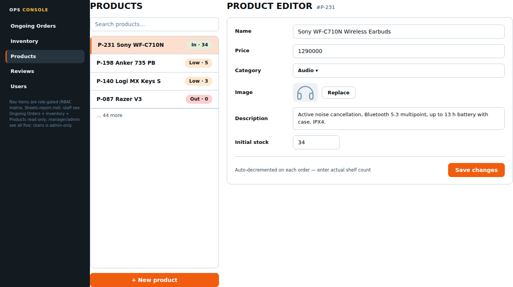

# Page: Per Product Dashboard — Design Spec (Sunset Glow)

Palette: `docs/color-tokens.md`. Roles: `Sheets-report.md`.
Access: **manager/admin only** (matrix: add new product / update stock
quantity / change product details all F for buyer+staff). This is the
product CRUD console: list, add, edit (pre-filled form per the sheet).

## FEATURES

- **Product list** (all products, with search filter — reuse `SearchInput`
  pattern): name, category, price, stock, status. Read-only columns;
  editing happens via the form, not inline (keeps this doc consistent with
  the stock-editing TBD in Inventory Dashboard — the **form** is the canonical
  edit surface; inline quick-sets live on Inventory Dashboard and PATCH the
  same field).
- **Add product:** `POST /products` (high-level assumption) with the
  **locked field set** from the sheet: name, price, description, image,
  category, initial stock.
- **Edit product:** pre-filled form (sheet's "pre-filled edit form"),
  `PATCH /products/:id` — same fields; image shows current thumbnail +
  replace control; stock field participates in the same edit form here
  (the stock-editing-location TBD defaults to the form for full edits).
- **Stock-decrement note (open decision #5): TBD** — if decrements are
  automatic, the stock field's helper text reads "Auto-decremented on each
  order — enter actual shelf count". No behavior change in UI.
- **Delete product:** matrix has no "delete product" permission; product
  CRUD in the sheet = add/edit. **Out of scope — do not ship a delete
  button in v1** (flagged).
- **Spec fields (electronics domain, TBD):** Product Details designs a
  per-product spec table (model number, Bluetooth version, battery,
  compatibility, …). The sheet's locked field set has **no specs** — if
  the team adds them, this form gains a repeatable name/value spec pair
  (ordered list) and the list view gains a "specs" column or detail
  affordance. No layout change designed here until decided (flagged,
  same decision as the Product Details doc).

## LINKS / NAVIGATION

- Arrival: ops nav "Products"; Inventory Dashboard "Open editor" (pre-filled
  for that product); deep-link `/ops/products/:id/edit`.
- Success (add) → list with new row highlighted; success (edit) → stays in
  form with success flash.
- No links into storefront pages.

## VISUALIZATION




ASCII wireframe (desktop):

```
+------------------------------------------------------------------+
| OPS CONSOLE   [Ongoing Orders] [Inventory] [Products] [Reviews]  |
+------------------------------------------------------------------+
| PRODUCTS                        PRODUCT EDITOR (#P-231)          |
| [search products………]       +----------------------------------+ |
| +------------------------+   | Name      [_______________]    | |
| | P-231 Sony WF-C710N 34|   | Price     [_______________]    | |
| | P-198 Anker 735 PB   5|   | Category  [ Audio ▾ ]         | |
| | P-140 Logi MX Keys S  3|   | Image     [ thumb | Replace ]  | |
| | P-087 Razer V3       0|   | Description [textarea………]      | |
| | …                      |   | Initial stock [___________]     | |
| +------------------------+   +----------------------------------+ |
| [ + New product ]            | [ Save changes ]   (primary)        | |
+------------------------------+-----------------------------------+ |
```

Mobile (<768px): list and form stack; form becomes the primary view when an
item is selected (back link to list). Admin consoles are desktop-first.

## COLOR USAGE

| Element | Token |
|---|---|
| Canvas / list border / form border | `#FFFFFF` / `blueSlate-200` |
| List row hover / selected | `blueSlate-50` / `atomicTangerine-100` left bar |
| List stock badges (in/low/out) | `willowGreen-100` / `carrotOrange-100` / `strawberryRed-100`, text `blueSlate-900` (low-stock = warning role per color-tokens §3) |
| Form labels | `blueSlate-950` (14px, medium) |
| Input border / focus ring | `blueSlate-200` / `atomicTangerine-500` |
| Field error | `strawberryRed-600` text, `strawberryRed-100` tint under field |
| Image upload dropzone | dashed `blueSlate-300` border, `blueSlate-700` helper; invalid image → `strawberryRed` variant |
| "Save changes" CTA | `atomicTangerine-500` → `atomicTangerine-600` hover |
| "New product" button | `atomicTangerine-500` white label |
| Success flash (row / form) | `willowGreen-100` bg, `willowGreen-600` text |

## INTERACTIONS

(React: `ProductManager`, `ProductList`, `ProductForm`, `ImageDropzone`.)

- **Validation (add):** name required; price > 0 numeric; category required
  (select from existing categories — assumption; category CRUD not in sheet,
  flagged); image required for publishable listing (or allow "publish without
  image"? **TBD**, assume required); initial stock ≥ 0 integer.
  Edit: same, pre-filled; stock field = current value.
- **Enabling logic:** Save disabled until all required fields valid; dirty
  tracking — leaving with unsaved changes shows a confirm dialog.
- **Hover:** list rows `blueSlate-50`; buttons standard tangerine ramp.
- **Active/loading:** Save shows spinner + "Saving…", form locks during save.
- **Error (field-level):** `strawberryRed` inline (e.g. price 400 from
  server); (form-level) `strawberryRed` banner above the form, `role="alert"`.
- **Disabled (state):** none role-wise beyond the page guard (manager+
  only). No staff/buyer UI on this page.
- **a11y:** form fields labelled; select uses native `<select>`; image drop
  zone has keyboard-replace input; stock badge text always present.
