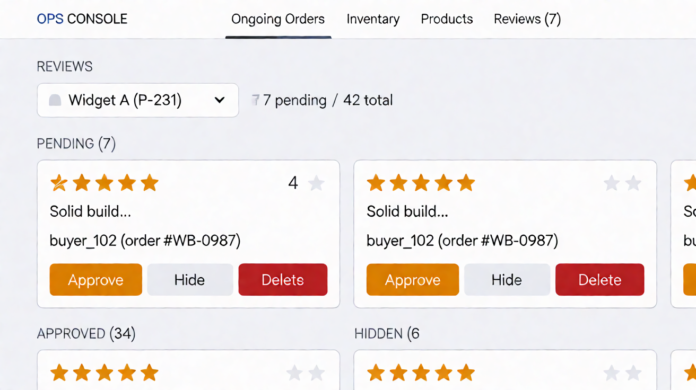

# Page: Per Product Review Panel — Design Spec (Sunset Glow)

Palette: `docs/color-tokens.md`. Roles: `Sheets-report.md`.
Typography & spacing per docs/design-tokens-round3.md (Inter 400/500/600, 8pt grid, unified pill badges, filled CTA stack).
Access: **manager/admin only** (matrix: moderate reviews F/F/T/T). This is the
moderation console: approve / hide / delete reviews, scoped per product.

## FEATURES

- **Product selector** at top (since the page is "Per Product"): pick a
  product → its review queue. Arrivals from a deep-link pre-select.
- **Review list** grouped by moderation state:
  - `pending` — new reviews awaiting a decision (top of queue, most
    prominent).
  - `approved` — live on Product Details.
  - `hidden` — suppressed but kept (restorable).
  Sheet locks review status to pending/approved/hidden (report §"Decisions
  the sheet locks in"). **Delete** is one of the three moderation actions in
  the page list ("approve/hide/delete") — a hard delete is a distinct,
  destructive action; no undo is specified (flagged).
- **Rating display (open decision #10): TBD** — assume 1–5 stars consistent
  with Product Details (`StarRating` shared, read-only here).
- Purchase-gate context: each review shows the buyer's name + the order it
  came from (moderators need provenance; buyer accounts are only manageable
  by admin — no link into User Dashboard from here).

## LINKS / NAVIGATION

- Ops nav "Reviews" (manager/admin item; hidden from staff per matrix —
  "moderate reviews" F for staff).
- Arrivals: ops nav; deep-link `/ops/reviews?product=P-231`.
- No exit to storefront; "See on store" link → Product Details (variant B,
  read-only) — optional, flagged.

## VISUALIZATION




ASCII wireframe (desktop — vertical 230px dark ops sidebar, not a top bar):

```
+------------------+-------------------------------------------------------+
| OPS CONSOLE      | Reviews      Product: [ Sony WF-C710N (P-231) ▾ ]   |
|------------------+   7 pending / 42 total (meta, blueSlate-700)         |
| Ongoing Orders   |+-------------------------------------------------------|
| Inventory        | | PENDING  [7]  (accent bar tuscanSun-500)             |
| Products         | | +--------------------------------------------------+|
| > Reviews [7]    | | | ★★★★☆ "Solid build, ANC keeps up on the train…" |
| Users            | | |            — buyer_102 · Sony WF-C710N ×1 (order #WB-0987)|
| (foot: role-gated| | | [ Approve ] [ Hide ] [ Delete (confirm) ]            |
|  note)           | | +--------------------------------------------------+|
|                  | | ★★★★★ "Fast charge, great for travel"                 |
|                  | | |            — buyer_207 · Anker 735 PB ×1 (order #WB-0951) |
|                  | |  [ Approve ] [ Hide ] [ Delete (confirm) ]            |
|                  | | APPROVED [34] (collapsed, newest first) [ Expand ▾ ] |
|                  | | HIDDEN  [6]  (collapsed; per item [ Restore ][Delete])|
+------------------+-------------------------------------------------------+
```

Mobile: sections stack vertically; action buttons wrap to a full-width row
under each card.

## COLOR USAGE

| Element | Token |
|---|---|
| Canvas / card border | `#FFFFFF` / `blueSlate-200` |
| Section headers | `blueSlate-950`; count badges `blueSlate-100` bg, `blueSlate-700` text; section accent bars 4×20 (pending `tuscanSun-500`, approved `willowGreen-500`, hidden `blueSlate-400`) |
| "Pending" section accent bar | `tuscanSun-500` |
| Review card stars | `tuscanSun-500` filled / `tuscanSun-200` empty |
| Buyer / order provenance | `blueSlate-700` 13/400 text |
| Approve button | `willowGreen-600` bg, white label (hover `willowGreen-700`, active `willowGreen-800`) |
| Hide button | secondary: white fill, 1px `blueSlate-200` border, `blueSlate-950` text, hover bg `blueSlate-100` |
| Delete button | `strawberryRed-600` bg white text (hover `-700`, active `-800`) |
| Restore button | `seagrass-500` bg, white label |
| Success flash (after approve/restore) | row tint `willowGreen-100`, text `willowGreen-600` |
| Danger confirm dialog | `strawberryRed-100` bg, heading `strawberryRed-700` |

## INTERACTIONS

(React: `ReviewPanel`, `ProductSelect`, `ReviewCard`, `ConfirmDialog`.)

- **Idle:** queue sorted: pending first (newest), then approved, then hidden
  (collapsed behind a count header).
- **Approve:** optimistic move to Approved section + success flash;
  `PATCH /reviews/:id/status` (high-level assumption). Reverts with a
  `strawberryRed` toast on failure.
- **Hide:** optimistic move to Hidden section.
- **Delete:** **requires `ConfirmDialog`** — text: "Delete review by
  buyer_102? This cannot be undone." Buttons: Cancel (secondary) / "Delete"
  (`strawberryRed-600`). No undo in v1 (flagged).
- **Disabled logic:** a review in any state has exactly the actions valid
  for that state (pending → approve/hide/delete; approved → hide/delete;
  hidden → restore/delete); other buttons absent, not greyed.
- **Loading:** static skeleton cards per section (no shimmer loops; skeletons
  stay still under `prefers-reduced-motion`). **Error:** `strawberryRed` panel
  with retry; failed optimistic actions roll the card back.
- **Empty states:** "No pending reviews" (celebratory-light: `willowGreen`
  check icon) vs "No reviews for this product".
- **Role-based visibility:** whole page manager/admin only; staff get no
  nav item and are route-redirected to Ongoing Orders.
- **a11y:** action buttons text-labelled (never icon-only); confirm dialog
  traps focus; section moves announced via `aria-live="polite"`.
