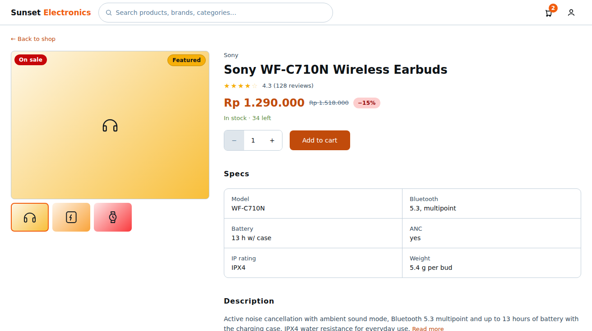

# Page: Product Details — Design Spec (Sunset Glow)

Palette: `docs/color-tokens.md`. Roles: `Sheets-report.md`.
Matrix: "view product details" T for **all 4 roles** — this page is the only storefront
page that staff/manager/admin legitimately open (e.g. to check stock or see pending
reviews). The two variants are in §INTERACTIONS.
Typography & spacing per `docs/design-tokens-round3.md` (Inter 400/500/600, 8pt grid,
unified pill badges, filled CTA stack).

## FEATURES

- Single product view: image, description, price, **stock**, reviews + Add to Cart
  (buyer). Stock display: "In stock" / "Only N left" / "Out of stock" (exact number
  public for buyers — most likely interpretation; a "low stock" threshold of 5 assumed).
- **Review placement (open decision #9, conflict: notes say order-history page, page
  list attaches it here):** this doc designs reviews **read-only on Product Details**
  (list, average, moderation state) and the **review form** living on Orders Placed.
  Marked **TBD** — if the team flips it, the review list component (`ReviewList`)
  moves; the form stays on Orders Placed either way (purchase-gating is cleaner there).
- **Rating scale (open decision #10): TBD.** Most likely interpretation: 1–5 star
  scale, half-star display, average shown as `4.3 / 5 (128)`. Component
  `StarRating` is built scale-agnostic (props: `value`, `count`, `readOnly`, `onRate`).
- **Sale marking:** discount renders as a struck original price next to the current
  price plus a "−15%" chip; the hero tile also carries the "On sale" + "Featured"
  pill pair when applicable (same pill spec as the catalog cards).
- **Product spec table (electronics domain):** products carry a key-value spec
  table — e.g. for "Sony WF-C710N Wireless Earbuds": Model (WF-C710N), Bluetooth
  (5.3, multipoint), battery (up to 13 h with case), ANC (yes), water resistance
  (IPX4), weight (5.4 g/bud). Per-product fields vary by category (gaming:
  switch type / poll rate / connectivity; laptops: CPU / RAM / display; smart
  home: Wi-Fi / Zigbee / Matter; wearables: compatibility iOS/Android,
  health sensors). Data model assumption: spec fields live on the product
  record (name/value pairs, ordered); the locked sheet field set (name, price,
  description, image, category, stock) does **not** include specs — spec support
  is a **TBD** addition (open decision, flagged for product-form/backend — the
  Per Product Dashboard form would need the extra fields too).

## LINKS / NAVIGATION

- Arrivals: Main Store card, Search/Browse card, direct deep-link `/products/:id`.
- In-page: back link → last catalog page (history-aware, falls back to Main Store).
- Add-to-Cart success → toast with "View cart" action → Cart.
- No review submission here (see §FEATURES TBD).

## VISUALIZATION




ASCII wireframe (desktop):

```
+------------------------------------------------------------------+
| Sunset Electronics [ search........ ]  (cart:2)  (account)       |
+------------------------------------------------------------------+
| ← Back to shop                                                  |
| +------------------+   +----------------------------------------+
| | [hero tile 4:3]  |   | Sony  (brand meta, 13/400)            |
| | Audio gradient    |   | Sony WF-C710N Wireless Earbuds  (h1)  |
| | (on sale)(Featured)|   | ★★★★☆ 4.3 (128 reviews)             |
| |  thumb · thumb · |   | Rp 1.290.000   Rp 1.518.000  [−15%]   |
| |  thumb (84×64)    |   | In stock · 34 left                   |
| +------------------+   | [− 1 +]  [ Add to cart ]              |
|                        |----------------------------------------+
|  Specs (label)         [ 2-col key/value table, 1px border ]    |
|  Description (label)   [ body text …  Read more ]              |
|  Reviews (128) + filter row                                      |
|  [ ★★★★☆ "Solid build, ANC keeps up…"  12 Sep 2026             |
|    buyer_102 · purchased Sony WF-C710N ×1 ]                     |
+------------------------------------------------------------------+
```

Mobile: image stacks on top (4:3 crop), info column below; grid gap 32px → 24px.

## COLOR USAGE

| Element | Token |
|---|---|
| Canvas | `#FFFFFF` |
| Product name | `blueSlate-950` h1 26/36 w600; brand subline `blueSlate-700` 13/400 |
| Hero price | `atomicTangerine-600` 24/32 w600 |
| Strike price | `blueSlate-600` 13/400, line-through |
| Discount chip ("−15%") | `strawberryRed-100` bg, `strawberryRed-700` label (pill) |
| Tile badges | "On sale" `strawberryRed-600` fill white (top-left); "Featured" `tuscanSun-500` fill, `blueSlate-950` text, 1px `tuscanSun-600` border (top-right) |
| Hero tile / thumbnails | 4:3 135° category-keyed gradient (Audio `tuscanSun-50→400`, etc.); thumbnails 84×64, active ring 2px `atomicTangerine-500` |
| Stock line: in-stock / low / out | `willowGreen-600` / `willowGreen-600` w/ "Only N left" / `strawberryRed-700` on `strawberryRed-100` pill + tile opacity .4 |
| Stars filled / empty | `tuscanSun-500` / `tuscanSun-200` (**TBD: open decision — star-rating colors**) |
| Spec table: label / key / value | `blueSlate-950` 16/24 w600 .05em / `blueSlate-700` 13/400 / `blueSlate-950` 14/500; table + row borders `blueSlate-200`, radius 10px |
| Description body | `blueSlate-700` 14/22 w400; "Read more" link `atomicTangerine-600` |
| Quantity stepper | `blueSlate-200` border, radius 8px, 44px cells; value `blueSlate-950`; disabled side `blueSlate-100` bg, `blueSlate-500` glyph |
| Add to cart button | filled 44px: `atomicTangerine-600` idle → `-700` hover → `-800` active, white 14/500 label; disabled = `blueSlate-100` bg + `blueSlate-400` text |
| Review card | border `blueSlate-200`, radius 10px; review text `blueSlate-950` 14/500; meta line `blueSlate-700` 13/400 |

## INTERACTIONS

(React: `ProductDetail`, `ProductImageGallery`, `QuantityStepper`, `AddToCartButton`,
`ReviewList`, `StarRating`.)

**Buyer variant (default):**

- **Idle:** hero image + three category-keyed thumbnails (swap on click, `aria-live`
  announcement); section rhythm — Specs / Description / Reviews blocks spaced 40px,
  section labels 16/24 w600 sentence case with 16–20px gap to content.
- **Quantity stepper:** min 1, max = stock; at max the "+" disables
  (`blueSlate-100` bg, `blueSlate-500` icon) — prevents ordering past stock.
- **Add to cart:** out of stock → button replaced by disabled "Out of stock"
  (`strawberryRed-700` text on `strawberryRed-100` bg, `cursor-not-allowed`).
  In stock → optimistic add, toast "Added — View cart" (`willowGreen-100` bg,
  `willowGreen-600` text); on failure → `strawberryRed` toast, stock line refetched
  (stock may have dropped → quantity clamped, stepper shows why).
- **Loading:** static image skeleton + line skeletons (`blueSlate-100` blocks — no
  shimmer; `prefers-reduced-motion` honored). **Error:** panel `strawberryRed-100` bg,
  `strawberryRed-700` text + "Try again" filled `strawberryRed-600` button.
- **Reviews:** only approved reviews render (moderation handled server-side — most
  likely). Hidden reviews are invisible to buyers (not "shown as hidden").
- **a11y:** stock line has `aria-live="polite"`; image swap updates
  `alt` text; stars have `aria-label="Rated 4.3 out of 5, 128 reviews"`;
  focus ring 2px `atomicTangerine-500` offset 2; all touch targets ≥ 44px.

**Staff/manager/admin variant (variant B, read-only storefront view):**

- Same layout, minus: Add to Cart, quantity stepper, cart badge in header.
- Stock line gets a link "Manage stock →" → Per Product Dashboard (manager/admin) or
  Ongoing Orders (staff). Reviews with `pending` status show an extra
  "Awaiting moderation" chip (`tuscanSun-100` bg, `blueSlate-900` text).
- No purchase CTA of any kind — matrix: "purchase product" F for all non-buyers.
