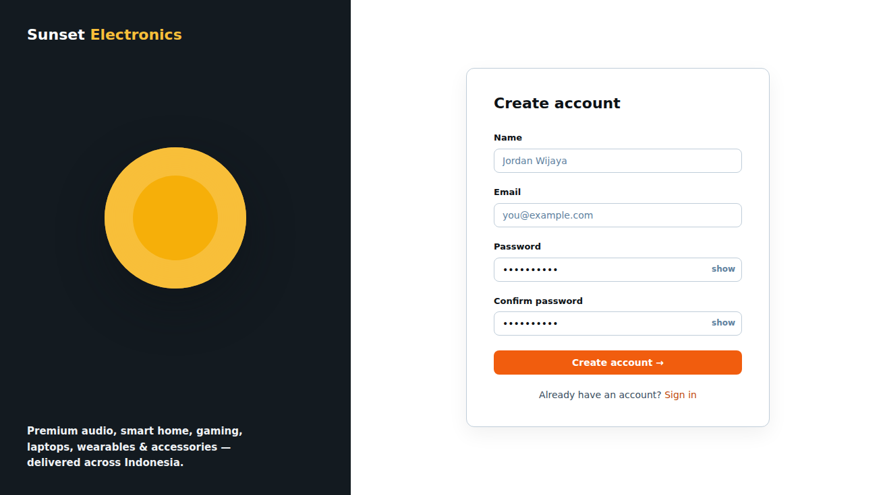

# Page: Register — Design Spec (Sunset Glow)

Palette: `docs/color-tokens.md`. Roles: `Sheets-report.md` RBAC matrix.
React component names are hints only — this is a design plan, not code.

**SHARED LAYOUT (locked with Login, `docs/login/design.md`):** this page and Login share
one layout — the two-panel `AuthLayout` below (brand panel + form card, same logo placement,
typography, spacing, colors, and mobile collapse). They differ **only in the form**
(registration fields vs sign-in fields). The layout in this doc is identical to
`docs/login/design.md`; the layout in that doc is identical to this one.

## FEATURES

- Buyer self-service registration: name, email, password (+ confirm field, UI convenience).
- Role note: the matrix marks "login/register" T for all 4 roles, but in practice only **buyers**
  self-register; staff/manager/admin accounts are provisioned by the admin via User Dashboard
  (admin-only "manage user accounts"). This page therefore creates **buyer** accounts. Flagged
  assumption — the sheet is silent on who provisions non-buyer accounts.
- Success → automatic sign-in → Main Store.
- Email uniqueness is enforced server-side (high-level API assumption: `POST /users` returns
  409 on duplicate).

## LINKS / NAVIGATION

- "Already have an account? Sign in" → Login. Nothing else.
- Post-success: auto-login, redirect to Main Store.

## VISUALIZATION




ASCII wireframe (desktop, ≥768px) — **identical to Login's wireframe; only the form and copy differ:**

```
+--------------------------------------------------------------+
|  LOGO                                                         |
+---------------------------------+----------------------------+
|  (brand panel: blueSlate-900,   |   Create account           |
|   tuscanSun sun shape)          |   +----------------------+ |
|                                 |   | Name                 | |
|  Tagline (blueSlate-50)        |   +----------------------+ |
|                                 |   +----------------------+ |
|                                 |   | Email                | |
|                                 |   +----------------------+ |
|                                 |   +----------------------+ |
|                                 |   | Password         [show] |
|                                 |   +----------------------+ |
|                                 |   +----------------------+ |
|                                 |   | Confirm password     | |
|                                 |   +----------------------+ |
|                                 |   [ Create account → ]    |
|                                 |   Already have an          |
|                                 |   account? Sign in         |
+---------------------------------+----------------------------+
```

Mobile (<768px): brand panel collapses to a 64px top strip with the logo; card full-bleed with
24px gutters; minimum field height 44px. **Same collapse rule as Login.**

## COLOR USAGE

Shared rows are **identical to Login's color table** (same brand panel, card, inputs, button,
link, error). Register-only extras are marked below.

| Element | Token |
|---|---|
| Page canvas | `#FFFFFF` |
| Brand panel (desktop) | `blueSlate-900` bg, `tuscanSun-400` sun graphic, `blueSlate-50` tagline |
| Card surface | canvas white, border `blueSlate-200`, radius 12px |
| Labels / headings / input text | `blueSlate-950` |
| Input placeholder | `blueSlate-500` |
| Input border idle / hover / focus ring | `blueSlate-200` / `blueSlate-300` / `atomicTangerine-500` |
| Primary button idle → active | `atomicTangerine-500` → `atomicTangerine-600`, white label |
| Sign-in link | `atomicTangerine-600`, underline on hover |
| Error text / banner | `strawberryRed-600` on `strawberryRed-100`, border `strawberryRed-300` |

Register-only extras (no counterpart on Login — not layout, so outside the shared rule):

| Element | Token |
|---|---|
| Helper text (field hint) | `blueSlate-700` |
| Success flash (pre-redirect, optional) | `willowGreen-100` bg, `willowGreen-600` text |

## INTERACTIONS

(React: same shared `AuthLayout` two-panel container + brand panel as Login — **identical layout**;
`RegisterForm` on the form side, reusing `InputField`, `PrimaryButton`. The form side is the only
difference; see `docs/login/design.md`.)

- **Idle:** Submit disabled until name non-empty, email format-valid, password ≥8, confirm ===
  password.
- **Validation:** inline on blur per field; confirm field re-validates live when either
  password changes. Duplicate email (409 on submit) → "An account with this email already
  exists" under the email field. (Optional live pre-check `GET /users/check-email` —
  **TBD**, assume submit-time check for simplicity.)
- **Hover/active:** same button ramp as Login.
- **Loading:** button spinner + "Creating account…"; inputs disabled.
- **Error:** field-level (`strawberryRed-600`) + form-level banner for 409/500.
- **Success:** auto-login, redirect to Main Store; the transition to a logged-in storefront is
  the feedback — no extra confirmation screen.
- **Keyboard/a11y:** focus rings, `htmlFor` labels, `aria-describedby` on errors.
