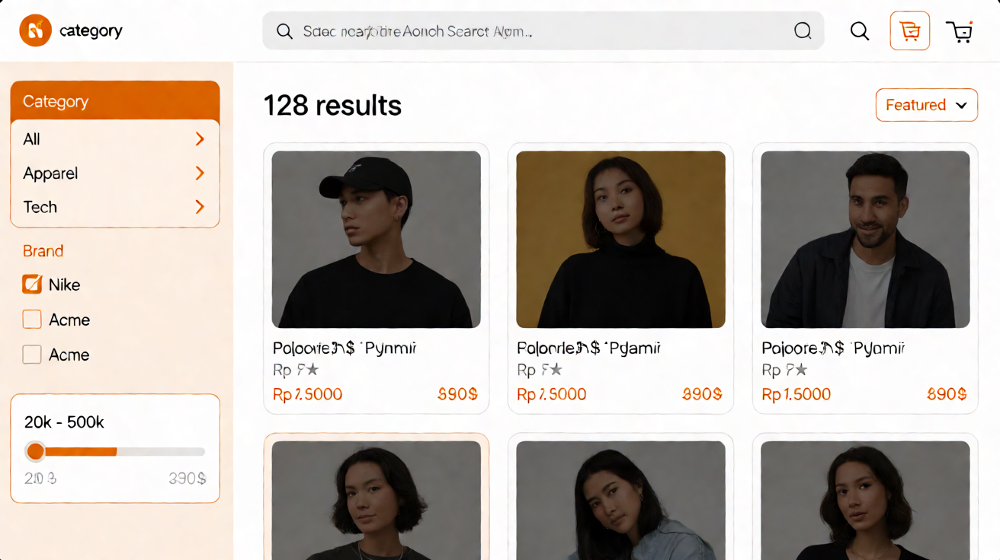

# Page: Search / Browse — Design Spec (Sunset Glow)

Palette: `docs/color-tokens.md`. Roles: `Sheets-report.md`.
Filtered catalog view — same `ProductCard`/`ProductGrid` as Main Store, plus a filter rail.
Shared shell: `StorefrontHeader` (search bar pre-filled on arrival from header search).

## FEATURES

- Search + filter the catalog (buyer). Locked axes from the sheet: **category, price, brand +
  free-text**. No other axes (do not invent sort-by-rating etc. without a sheet basis —
  a plain "Sort: Featured / Price ↑ / Price ↓" is a reasonable assumption and flagged).
- Results are a paginated/`Load more` grid consistent with Main Store.
- **Role-gating (TBD — open decision #8):** buyer-only per the page list, which
  contradicts the matrix granting browse/view-detail to staff+ (also flagged in
  the Inventory Dashboard role note). Most likely interpretation used here:
  buyer-only. If the team resolves it to "staff can also browse", route guard
  widens to `buyer | staff` — layout unchanged
  (staff read-only, no Add-to-Cart / no cart badge, same as Main Store).
- Filter state lives in URL query params (shareable/refreshable — most likely
  interpretation; sheet is silent).

## LINKS / NAVIGATION

- Arrivals: header search submit (all roles landing on storefront), "Browse" link in header
  (if included — most likely: header is Search + cart + account only; Browse reached via
  search). Direct deep-link: `/search?query=&category=&brand=&priceMin=&priceMax=&sort=`.
- Card → Product Details.
- "Clear all" → returns to `/search` with empty params (results = full catalog, same as
  Main Store grid but no featured strip).
- In-flow: filters never navigate — they refetch in place.

## VISUALIZATION




ASCII wireframe (desktop):

```
+------------------------------------------------------------------+
| LOGO  [ search bar................. ]   (cart:2)  (account)      |
+------------------------------------------------------------------+
| FILTERS   |  128 results            Sort: [Featured ▾]           |
| Category  |  +--------+ +--------+ +--------+ +--------+         |
|  All      |  | card   | | card   | | card   | | card   |  …       |
|  Apparel  |  +--------+ +--------+ +--------+ +--------+         |
|  Tech    |  +--------+ +--------+ +--------+ +--------+          |
| Brand    |  | card   | | card   | | card   | | card   |          |
|  [x] Nike|  +--------+ +--------+ +--------+ +--------+          |
|  [ ] Acme|  [ Load more ]                                            |
| Price     |                                                          |
| [---o-----] 20k – 500k                                         |
+------------------------------------------------------------------+
```

Mobile (<768px): filter rail becomes a bottom sheet / off-canvas drawer ("Filters (3)"
button shows active count); grid 2-up at ≥390px, 1-up below; search bar stays in the
sticky header row.

## COLOR USAGE

| Element | Token |
|---|---|
| Canvas / cards | `#FFFFFF`, card border `blueSlate-200` |
| Result count, helper text | `blueSlate-700` |
| Filter section titles | `blueSlate-950` |
| Filter option idle / hover / active-selected | `blueSlate-950` / `blueSlate-50` bg / `atomicTangerine-600` text + `atomicTangerine-500` check |
| Price slider track / fill / thumb | `blueSlate-200` / `carrotOrange-400` / `atomicTangerine-500` |
| "Clear all" link | `strawberryRed-600` |
| Sort control | ghost, `blueSlate-950` text, `blueSlate-200` border, hover `blueSlate-50` |
| Filter drawer toggle (mobile) | `atomicTangerine-500` bg white label when active filters present |
| Empty-results panel | `blueSlate-50` bg, heading `blueSlate-950`, helper `blueSlate-700` |
| API error panel | `strawberryRed-100` bg, `strawberryRed-600` text + "Try again" |

## INTERACTIONS

(React: `SearchResults`, `FilterRail`, `FilterAccordion`, `PriceRange`, `ProductGrid`.)

- **Idle:** filter accordion sections default open: Category; closed: Brand, Price
  (progressive disclosure — first axis most useful).
- **Applying filters:** debounced free-text (300ms) + immediate for category/brand
  toggles; loading state = skeletons in the grid, filters stay enabled except
  the control being re-queried.
- **Hover:** filter options get `blueSlate-50` bg; card hover matches Main Store.
- **Active (applied):** applied chip row above the grid when any filter active —
  each chip removable (× chip `strawberryRed-600`), plus "Clear all".
- **Disabled:** slider thumbs disabled while request in flight.
- **Loading:** skeletons; "Load more" button shows spinner and disables.
- **Empty:** no results → "No matches for …" + suggested action (remove one filter at a
  time — offer "Clear all" prominently). Not an error: `blueSlate-50` panel.
- **Error:** `strawberryRed` panel with retry; last good results stay on screen behind
  the panel (never white-screen the user on a failed refetch).
- **Role-based visibility:** staff variant read-only (see §FEATURES).
- **Keyboard/a11y:** slider uses native range inputs with visible values; accordion
  buttons `aria-expanded`; results grid is a semantic list; filter changes announced
  via `aria-live="polite"` result count.
