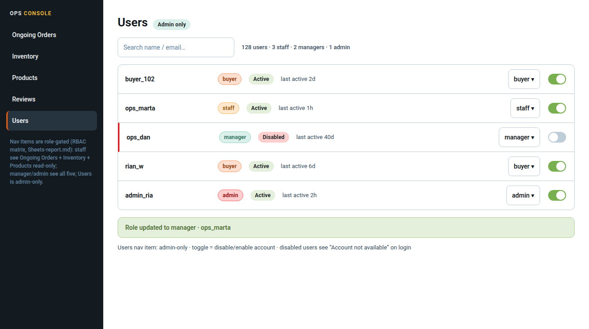

# Page: User Dashboard — Design Spec (Sunset Glow)

Palette: `docs/color-tokens.md`. Roles: `Sheets-report.md`.
Typography & spacing per docs/design-tokens-round3.md (Roboto 400/500/600, 8pt grid, unified pill badges, filled CTA stack).
App shell & gutter (v4): `docs/control-panel/design.md` — the ops sidebar is a 230px `--ops-sidebar-w` token and the sidebar-to-content gutter is an explicit `.ops-content` padding (`--ops-page-pad` 32px desktop / 24px mobile), reset-proof by class specificity. This page's content sits 32px off the sidebar; its internal table/panel layout is unchanged by the shell spec.
Access: **admin only** (matrix: "manage user accounts" F/F/F/T). The sheet
flags this as the "most sensitive feature" with strict route protection —
the strongest guard in the app.

## FEATURES

- **User list:** name, email, role (buyer/staff/manager/admin), account
  status (active/disabled), last activity. Search by name/email.
  The user base is the store's community: buyers of the electronics
  catalog + internal ops staff (wireframe examples are illustrative).
- **Role change:** per-user role select (buyer/staff/manager/admin),
  persisted via high-level `PATCH /users/:id/role` assumption. A
  user can be demoted from the list, or an admin can be promoted
  (staff/manager cannot manage users at all — F/F in matrix).
- **Disable / enable account:** per-user toggle. Disabled users cannot
  log in (their next login attempt shows the "Account not available"
  banner designed in the Login doc). **Disabling is not deleting** —
  the sheet's user management = role changes + disable; no delete-user
  permission is listed (out of scope, flagged).
- **Self-protection (strict route protection, sheet note):**
  - The admin cannot disable **their own** account (control hidden, not
    greyed — a disabled admin could not re-enable; flagged assumption).
  - Role changes require a **confirm dialog** when the target's role ≥
    the actor's (i.e. promoting/creating a peer admin) — most likely
    interpretation of "strict" beyond the page guard; exact threshold
    is **TBD** (flagged).
  - Route guard: admin-only, checked at route level + the API enforces
    server-side (report §"Implications": RBAC enforced server-side).
    Non-admins hitting the URL get a 404-style redirect, never an
    error page revealing the feature exists.

## LINKS / NAVIGATION

- Ops nav item **visible to admin only** (staff/manager nav omits it —
  visibility gating, not just route guards).
- Arrival: ops nav. No deep-link sharing expected (sensitive).

## VISUALIZATION



> mockup.png rendered from _mockup-build/out/user-dashboard.html via headless Chromium @ 2026-09-22


ASCII wireframe (desktop — vertical 230px dark ops sidebar, not a top bar):

```
+------------------+-------------------------------------------------------+
| OPS CONSOLE      | Users   [ Admin only ]                                 |
|------------------+-------------------------------------------------------|
| Ongoing Orders   | [ Search name / email… ]  128 users · 3 staff ·       |
| Inventory        |   2 managers · 1 admin                                |
| Products         |+-------------------------------------------------------|
| Reviews          | | buyer_102 [buyer] [Active]  last 2d  [role ▾][toggle]|
| > Users          | | ops_marta [staff] [Active]  last 1h  [role ▾][toggle]|
| (foot: role-gated| | ops_dan   [manager] [Disabled] last 40d [role ▾][toggle]|
|  note)           | | rian_w    [buyer] [Active]  last 6d  [role ▾][toggle]|
|                  | | admin_ria [admin] [Active]  last 2h  [role ▾][toggle]|
|                  |+-------------------------------------------------------|
|                  | Role updated to manager · ops_marta (success banner)  |
|                  | (footer note: toggle = disable/enable account)        |
+------------------+-------------------------------------------------------+
* Users nav item: admin-only; disabled-user row = 3px strawberryRed-500 left bar
```

Mobile: table → cards with role select + toggle. Admin consoles are
desktop-first; this page degrades to card list on <768px.

## COLOR USAGE

| Element | Token |
|---|---|
| Canvas / row border | `#FFFFFF` / `blueSlate-200` |
| Role select border / focus | `blueSlate-200`, 44px min-height, 8px radius; focus ring 2px `atomicTangerine-500`, offset 2px |
| Role select accent (admin value) | `atomicTangerine-600` text when admin selected |
| Status pill: active / disabled | unified pills `willowGreen-100` / `strawberryRed-100` tints, text `blueSlate-900`, 12/600, padding 4×10 |
| Role badge pills (buyer/staff/manager/admin) | color-tokens §5 role accents: accent-100 fill + accent-700 text + 1px accent-300 border (buyer `atomicTangerine`, staff `carrotOrange`, manager `seagrass`, admin `strawberryRed`), 12/600 pill |
| Toggle (enable/disable) | 44px hit area; track 40×24 — on-state `willowGreen-500`, off-state `blueSlate-200`, white 20px thumb; disabled-user row 3px `strawberryRed-500` left bar |
| Role change confirmation dialog | `strawberryRed-100` bg, heading `strawberryRed-700`, cancel secondary / confirm `atomicTangerine-600` filled stack (confirm label "Change role") |
| Disable confirmation dialog | `strawberryRed-100` bg, confirm `strawberryRed-600` bg white text |
| Success flash (row) | `willowGreen-100` tint + `willowGreen-300` border, `willowGreen-700` text "Role updated to manager · ops_marta" |
| Search input | standard `SearchInput` tokens: 44px min-height, `blueSlate-200` border, `atomicTangerine-500` focus ring, placeholder `blueSlate-500` |
| Count summary line | `blueSlate-700` |

## INTERACTIONS

(React: `UserDashboard`, `UserTable`, `RoleSelect`, `StatusToggle`,
`ConfirmDialog` (shared with Review Panel).)

- **Idle:** list paginated (assume 50/page, "Load more" consistent with
  other pages; flagged).
- **Role change:** open `ConfirmDialog` naming the user + old → new role:
  "Change buyer_102 from buyer to manager? They gain product and order
  management." Confirm / Cancel. Optimistic update + success flash;
  failure → `strawberryRed` toast + row reverts.
- **Disable:** `ConfirmDialog` (danger styling): "Disable ops_dan?
  They will not be able to log in." Confirm button `strawberryRed-600`
  (hover `-700`, active `-800`). Enabling is the reverse, `willowGreen-500`
  confirm, lighter copy. Toggles honor the 44px touch floor.
- **Disabled (control level):** own-row controls **absent** (self-protect);
  all other rows fully enabled. Loading: static table skeletons (no shimmer
  loops); buttons spinner-lock during saves.
- **Error:** row-level failure = `strawberryRed` toast + revert; page
  load failure = `strawberryRed` panel + retry.
- **Role-based visibility:** admin-only page AND admin-only nav item.
  Staff/manager: no nav link, route-redirect to Ongoing Orders (their
  home), no 403 page that names the feature.
- **Audit note (flagged, out of v1):** the sheet does not specify an
  audit log; recommend one (high-level) before role/disable actions
  become real — noted for backend-dev, not designed here.
- **a11y:** role select is a labelled native select; status pill always
  carries text; toggles keyboard-operable with visible focus ring.
